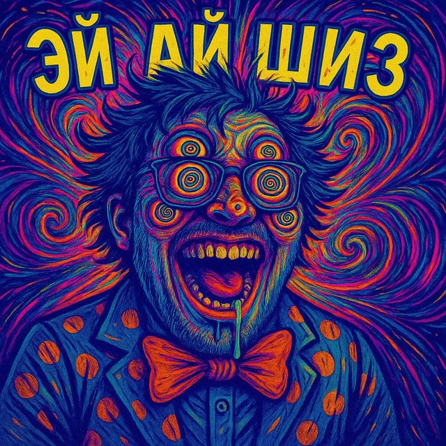

<div align="center">



# ЭЙ АЙ ШИЗ

**Персональный блог о том, как жить с шизой по AI**

AI-Agents · LLM · ML Inference · Квантизация · vLLM · RAG

[](https://astro.build)
[](https://react.dev)
[](https://typescriptlang.org)
[](https://mdxjs.com)

</div>

---

## О чём блог

Пишу о том, с чем работаю каждый день: поднимаю LLM, собираю AI-агентов, оптимизирую инференс и квантизую модели, чтобы они влезали туда, куда не должны. Ночные сессии с vLLM, баги в продакшене и находки — всё сюда.

## Что под капотом

| | |
|:--|:--|
| **Фреймворк** | Astro.js 5 + React 19 |
| **Контент** | MDX с кастомными интерактивными компонентами |
| **Темы** | Тёмная / светлая / системная — без мерцания при загрузке |
| **Код** | Shiki (GitHub-стиль), двойная тема, кнопка копирования |
| **SEO** | JSON-LD (WebSite, Person, BlogPosting, BreadcrumbList), Open Graph, Twitter Cards |
| **Фиды** | RSS, Sitemap |
| **UI** | Lightbox, прогресс чтения, поиск, навигация между статьями, scroll-to-top |
| **Шрифты** | Inter + JetBrains Mono |

## Быстрый старт

```bash
git clone https://github.com/aishiz/blog.git
cd blog
npm install
npm run dev
```

Откроется на `http://localhost:4321`

| Команда | Что делает |
|:--|:--|
| `npm run dev` | Dev-сервер с hot reload |
| `npm run build` | Production-сборка в `./dist/` |
| `npm run preview` | Локальный превью сборки |

## Структура

```
src/
├── assets/                # Изображения и медиа
├── components/            # UI-компоненты
│   ├── Header.astro       # Навигация + мобильное меню
│   ├── ThemeToggle.astro  # Переключатель темы
│   ├── SearchBar.tsx      # Поиск по статьям
│   └── article/           # Компоненты для MDX-статей
│       ├── Callout.astro        # Блоки info / warning / tip / fire
│       ├── QuantCard.astro      # Карточки с бейджами
│       ├── MemoryBar.astro      # Визуализация памяти
│       ├── StepList.astro       # Нумерованные шаги
│       └── VramCalculator.tsx   # Интерактивный калькулятор VRAM
├── content/blog/          # MDX-статьи
├── layouts/BlogPost.astro # Шаблон статьи
├── pages/                 # Маршруты
│   ├── index.astro        # Главная
│   ├── about.astro        # Обо мне
│   └── blog/              # Список + [slug]
└── styles/global.css      # Глобальные стили и CSS-переменные
```

## Как добавить статью

Создайте `.mdx` файл в `src/content/blog/`:

```mdx
---
title: 'Название статьи'
description: 'Краткое описание для SEO'
pubDate: 'Mar 01 2026'
heroImage: '../../assets/your-image.png'
---

import Callout from '../../components/article/Callout.astro';

# Заголовок

<Callout type="tip" title="Совет">
Используйте кастомные компоненты для интерактивности.
</Callout>
```

## Лицензия

MIT
