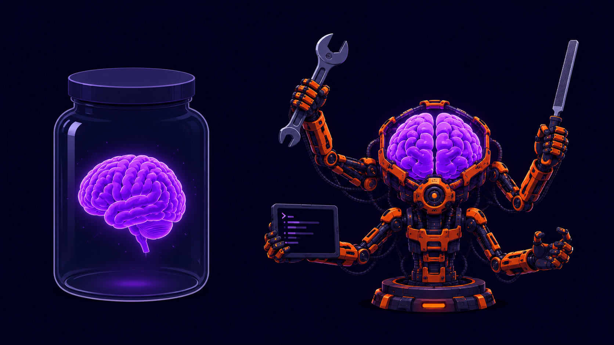
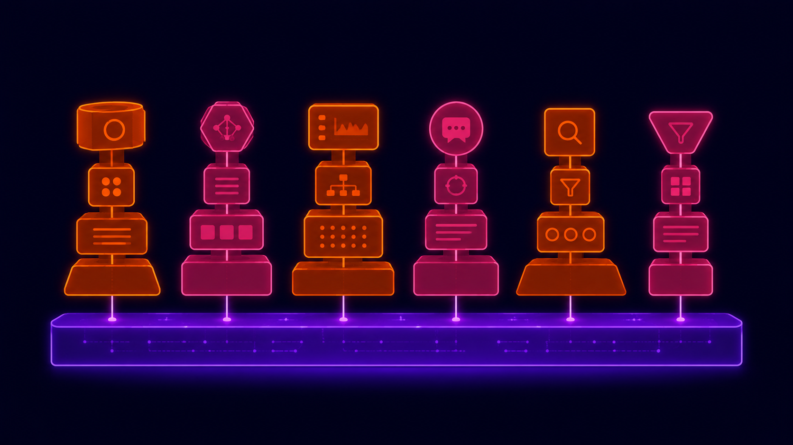

import Callout from '../../components/article/Callout.astro';
import QuantCard from '../../components/article/QuantCard.astro';
import MemoryBar from '../../components/article/MemoryBar.astro';
import StepList from '../../components/article/StepList.astro';
import AgentLoopViz from '../../components/article/AgentLoopViz';
import LifeWithoutHarness from '../../components/article/LifeWithoutHarness';
import HarnessAnatomy from '../../components/article/HarnessAnatomy';
import ContextWindowViz from '../../components/article/ContextWindowViz';
import HarnessComparison from '../../components/article/HarnessComparison';
import MiniHarnessSim from '../../components/article/MiniHarnessSim';

# Харнес агента: Что превращает тупую LLM в автономного работягу 🫡

Ну чё, малютки, думаете что **GPT-5.2** или **Claude** сами по себе чинят вам код, гоняют тесты и заказывают такси? Поздравляю, вас обманули маркетологи. Голая LLM — это **функция `текст → текст`**: суёшь ей строку, получаешь обратно другую строку. Ни памяти, ни рук, ни глаз. Сама по себе она не откроет даже пустой файл.

А «агент» из рекламы — это та же самая модель, просто посаженная в **харнес**. Обвязка, которая приделывает болтливому попугаю руки и пинает его работать, пока дело не сделано.

<Callout type="fire" title="Суть за 10 секунд">
**Харнес** (harness, «упряжь») — это вся инфраструктура вокруг LLM: цикл «подумал → сделал → посмотрел», вызов инструментов, управление контекстом, песочница для выполнения и парсинг ответов. Модель — это мозг. Харнес — это **тело, руки и нервная система**. Claude Code, Cursor, OpenClaw — это всё харнесы поверх одних и тех же моделей.
</Callout>

Короче, в этом посте разложу по полочкам: что такое харнес и нахуя он нужен, как страдальцы жили без него, из каких слоёв он состоит, и соберу **минимальный рабочий харнес на 20 строк Python** — чтобы вы пощупали, что там внутри.

---

## Что такое харнес и нахуя он нужен

Смотри, малютки. Всё, что умеет LLM сама по себе — предсказывать следующий токен. Не помнит прошлый запрос, не откроет файл, не запустит команду, не узнает, сработал её ответ или нет. Каждый вызов — с чистого листа, **stateless**.

<Callout type="info" title="Аналогия для тех, кто не в теме">
_Представь мозг гения в банке. Он гениально рассуждает, но у него нет глаз, рук и памяти дольше одного разговора. Чтобы он что-то сделал в реальном мире, кто-то должен: читать ему вслух задачу, выполнять его указания руками, и пересказывать, что получилось. Этот «кто-то» — и есть харнес._
</Callout>

Харнес добавляет модели три вещи, которых у неё нет от рождения:

<StepList steps={[
	{ num: "1", text: "<strong>Руки</strong> — инструменты (tools): прочитать файл, запустить команду, сходить в интернет, дёрнуть API" },
	{ num: "2", text: "<strong>Память</strong> — контекст: что уже сделали, что узнали, история диалога" },
	{ num: "3", text: "<strong>Цикл</strong> — модель работает не один раз, а крутится в петле «думай → действуй → наблюдай», пока задача не решена" },
]} />

Без харнеса у тебя чат-бот: спросил — ответил. С харнесом — **агент**: принёс задачу, ушёл, вернулся с результатом.



---

## Как жили без харнеса (раннее средневековье, 2015–2023)

А теперь, малютки, ностальгия. Когда вышел ChatGPT, никаких харнесов не было. Был ты, окно браузера и буфер обмена. **Исполнителем инструкций был ты сам.**

Алгоритм работы «AI-инженера» в 2023:

<StepList steps={[
	{ num: "1", text: "Спросил у модели, как пофиксить баг" },
	{ num: "2", text: "Она написала: «запусти вот эту команду и покажи вывод»" },
	{ num: "3", text: "Ты <strong>руками</strong> запустил команду в терминале" },
	{ num: "4", text: "<strong>Скопировал</strong> вывод, <strong>вставил</strong> обратно в чат" },
	{ num: "5", text: "Модель: «ага, теперь поправь файл вот так»" },
	{ num: "6", text: "Ты руками поправил. И так по кругу, пока не заработает (или пока не надоест)" },
]} />

Чувствуешь? **Ты и был харнесом.** Медленным, на ручном приводе, с копипастой через буфер обмена. Модель думала — а всю беготню (читать файлы, запускать команды, носить результаты туда-сюда) делал живой человек.

<LifeWithoutHarness client:visible />

Народ, конечно, пытался это автоматизировать промптами. Появился паттерн **ReAct** (Reasoning + Acting): модель просили выводить мысли в формате `Thought: … / Action: … / Observation: …`, а потом регэкспами выдирали `Action` из текста и выполняли. Так собрали **первый примитивный харнес** — кривой, на парсинге строк, но он работал.

<Callout type="warning" title="⚠️ Почему это была боль">
Модель — болтливая. Она могла вместо `Action: search("погода")` написать «Ну, я думаю, наверное стоит поискать погоду, давай я это сделаю». Регэксп ломался, парсер падал, агент уходил в небытие. **Парсинг текста — самое хрупкое место раннего харнеса.** Спасение пришло, когда модели научили нативному tool-calling — структурированному JSON вместо угадывания по тексту.
</Callout>

---

## Анатомия харнеса: 5 слоёв

Окей, малютки, теперь самое вкусное — что там внутри. Любой харнес, от Claude Code до твоего самописного, состоит из пяти слоёв. Тыкай по кольцам — внутри ядро-LLM, вокруг обвязка:

<HarnessAnatomy client:visible />

А вот как эти слои оживают в реальном цикле — жми «Запустить» и смотри, как модель и харнес перекидывают работу друг другу:

<AgentLoopViz client:visible />

<Callout type="tip" title="Вот что тут главное">
Смотри на ярлыки **LLM** и **ХАРНЕС** в цикле. Модель только **думает** и **просит**. Всё реальное — открыть файл, запустить тест, поймать вывод — делает харнес. Поменяй модель, а харнес оставь — агент продолжит работать. Поменяй харнес — изменится всё.
</Callout>

---

## Минимальный харнес на Python (~20 строк) 🔥

Хватит теории, малютки. Самый честный способ понять харнес — собрать его. Вот **полноценный агентный цикл** на голом Python + любой LLM с tool-calling. Никаких фреймворков.

```python
import json
from openai import OpenAI  # подойдёт любой клиент с tool-calling

client = OpenAI()

# --- Слой 2: инструменты (руки агента) ---
def run_shell(cmd: str) -> str:
    import subprocess
    # ponytail: для демо — реальный харнес гоняет это в песочнице, а не голым
    out = subprocess.run(cmd, shell=True, capture_output=True, text=True, timeout=30)
    return (out.stdout + out.stderr)[:4000]  # режем, чтобы не взорвать контекст

TOOLS = [{
    "type": "function",
    "function": {
        "name": "run_shell",
        "description": "Выполнить shell-команду и вернуть вывод",
        "parameters": {
            "type": "object",
            "properties": {"cmd": {"type": "string"}},
            "required": ["cmd"],
        },
    },
}]

# --- Слой 3: контекст (память агента) ---
messages = [{"role": "user", "content": "Сколько .py файлов в текущей папке? Посчитай."}]

# --- Слой 1: agent loop (сердце) ---
for _ in range(10):  # лимит итераций — иначе бесконечный цикл
    resp = client.chat.completions.create(
        model="gpt-5.2", messages=messages, tools=TOOLS,
    ).choices[0].message
    messages.append(resp)

    if not resp.tool_calls:        # модель сказала «готово» — отдаём ответ
        print(resp.content)
        break

    for call in resp.tool_calls:   # модель попросила инструмент — исполняем
        args = json.loads(call.function.arguments)   # слой 5: парсинг
        result = run_shell(**args)                   # слой 4: тут была бы песочница
        messages.append({                            # слой 3: результат назад в контекст
            "role": "tool",
            "tool_call_id": call.id,
            "content": result,
        })
```

Вот и весь харнес, малютки. **Цикл `for`**, который гоняет модель, исполняет её запросы инструментами и складывает результаты обратно в `messages`. Всё остальное — Claude Code, Cursor, LangGraph — это **тот же цикл**, только обвешанный песочницами, компакцией контекста, сотней инструментов и красивым UI.

<Callout type="tip" title="Что мы только что собрали">
Модель сама сообразит выполнить `ls *.py | wc -l`, дёрнет `run_shell`, получит число и выдаст человеческий ответ. Заметь: ты нигде не написал «как считать файлы». Ты дал **руки и цикл**, а думать оставил модели.
</Callout>

---

## Контекст — главная головная боль харнеса

Малютки, если думаете что цикл и инструменты — это сложно, то добро пожаловать в ад под названием **управление контекстом**. Это слой, на котором ломается большинство агентов.

Проблема простая: **окно контекста конечно.** Каждая итерация цикла добавляет в `messages` новые данные — мысли модели, вызовы, вывод команд (а вывод бывает на тысячи строк). Через 20 шагов отладки твой контекст забит под завязку.

Поиграйся сам — добавляй данные в контекст, доводи до переполнения и жми «Сжать»:

<ContextWindowViz client:visible />

Когда контекст переполняется — агент **тупеет и забывает**, с чего начал. Хороший харнес борется с этим:

<div class="grid-2" style="margin: 1.5em 0;">
<QuantCard title="✂️ Компакция" badge="Сжатие" badgeColor="#10b981">
Старую часть истории харнес сжимает в краткое саммари: «починили баг X, тесты прошли». Детали выкинуты, суть осталась. Claude Code делает это автоматически при заполнении окна.
</QuantCard>

<QuantCard title="📏 Усечение вывода" badge="Обрезка" badgeColor="#3b82f6">
Команда выплюнула 5000 строк лога? Харнес отдаёт модели последние 100. Полный вывод модели обычно не нужен — нужен хвост с ошибкой.
</QuantCard>

<QuantCard title="🔍 Подгрузка по требованию" badge="RAG" badgeColor="#8b5cf6">
Не пихать весь репозиторий в контекст, а дать модели инструмент `search` — пусть подтягивает только нужные куски, когда они нужны. Контекст остаётся чистым.
</QuantCard>

<QuantCard title="🧹 Изоляция подзадач" badge="Субагенты" badgeColor="#ff6b2b">
Жирную подзадачу харнес отдаёт отдельному субагенту со своим чистым контекстом. Тот возвращает только результат — вся его грязь не засоряет главный контекст.
</QuantCard>
</div>

<Callout type="fire" title="Вот в чём засада">
80% «тупизны» агентов — это не модель тупая, а **харнес плохо управляет контекстом**. Засрал окно мусором, не сжал историю, напихал нерелевантного — и гениальная модель захлёбывается в шуме. Качество агента = качество модели × качество управления контекстом.
</Callout>

---

## Реальные харнесы: кто есть кто

Ладно, малютки, теория — это хорошо, но вы пользуетесь конкретными харнесами каждый день. Вот кто из чего:

<HarnessComparison client:visible />

<Callout type="info" title="Вот что важно понять">
Все они крутятся поверх одних и тех же моделей (Claude, GPT, Gemini). Берёшь одну и ту же Claude, суёшь в наколеночный цикл — агент тупит и ходит по кругу. Суёшь в Claude Code — внезапно «сам всё сделал». Модель та же. Поменялась только обвязка.
</Callout>



---

## Подводные камни 🗑️🔥

Прежде чем побежите писать свой харнес — вот на чём все спотыкаются:

<Callout type="warning" title="♾️ Бесконечные циклы">
Агент застрял: думает → действует → не получается → думает то же самое → по кругу до конца света (и до конца твоего баланса на API). **Всегда ставь лимит итераций** и детект «топчемся на месте». В минимальном примере выше это `range(10)` — не убирай его.
</Callout>

<Callout type="warning" title="☠️ Отравление контекста (context poisoning)">
Одна галлюцинация или ошибка попала в контекст — и дальше модель строит всё на этом вранье, заражая весь диалог. Чем длиннее сессия, тем выше шанс. Лечится компакцией и иногда полным рестартом контекста.
</Callout>

<Callout type="warning" title="🎭 Галлюцинация вызовов">
Модель «вызывает» инструмент, которого нет, или суёт кривые аргументы. Слой валидации (5) должен ловить это и возвращать ошибку модели, а не падать. Никогда не доверяй, что вызов корректен — проверяй.
</Callout>

<Callout type="warning" title="💸 Цена">
Каждая итерация цикла — это полный прогон контекста через модель. 20 шагов с жирным контекстом = 20 раз оплатил весь контекст. Плохой харнес, который не сжимает контекст, жжёт деньги в разы быстрее. Токены — это твой счёт.
</Callout>

А теперь собери всё вместе сам, малютки. Выключай слои харнеса по одному и смотри, какой именно подводный камень тебя топит:

<MiniHarnessSim client:visible />

---

## Итого, малютки 🫡

<Callout type="fire" title="Главный вывод">
**Харнес — это то, что превращает LLM в агента.** Модель только думает; руки, память, цикл и песочницу даёт обвязка вокруг неё. Раньше этой обвязкой работал ты сам — глазами, руками и буфером обмена. Теперь за тебя пашут Claude Code и компания.
</Callout>

Про харнес почти никто не пишет, и зря. Все меряются бенчмарками моделей, лярдами параметров и MoE, а агенты за последний год скакнули в автономности по другой причине — обвязка повзрослела. Научилась жать контекст, гонять код в песочнице и не зацикливаться насмерть. Хочешь реально разобраться в агентах — собери свой харнес на 20 строк и поломай его об боевые задачи. Это даст больше, чем сотня тредов в X. Вперёд, малютки.

---

### Источники

1. [ReAct: Synergizing Reasoning and Acting in Language Models — arXiv](https://arxiv.org/abs/2210.03629)
2. [Building Effective Agents — Anthropic](https://www.anthropic.com/research/building-effective-agents)
3. [Function calling — OpenAI docs](https://platform.openai.com/docs/guides/function-calling)
4. [Effective context engineering for AI agents — Anthropic](https://www.anthropic.com/engineering/effective-context-engineering-for-ai-agents)
5. [LangGraph — концепции агентов](https://langchain-ai.github.io/langgraph/concepts/)
