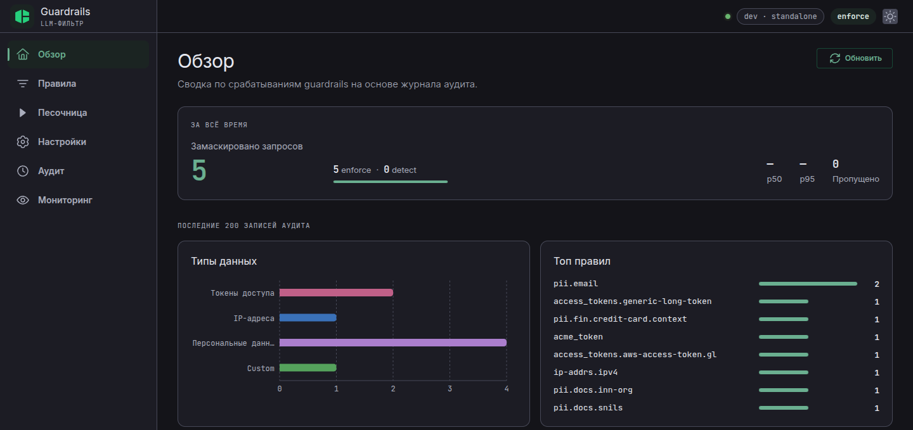
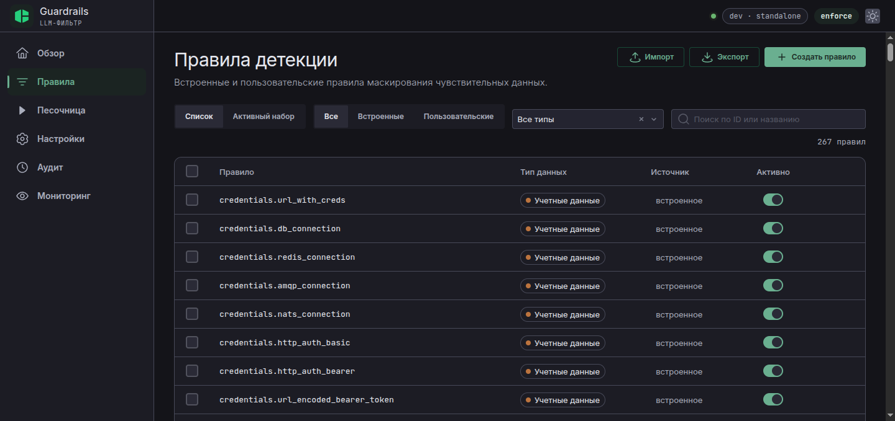
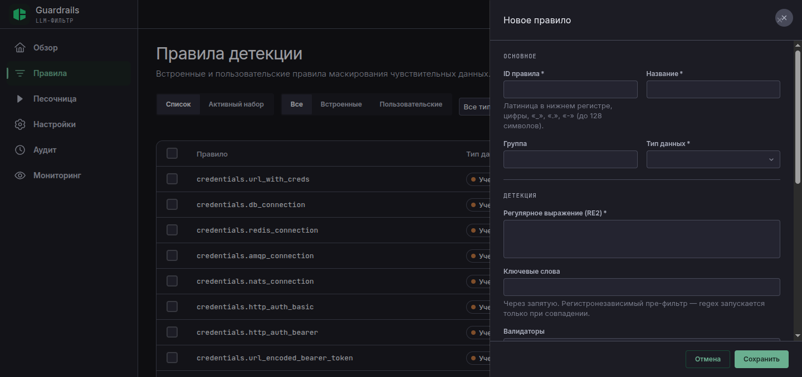
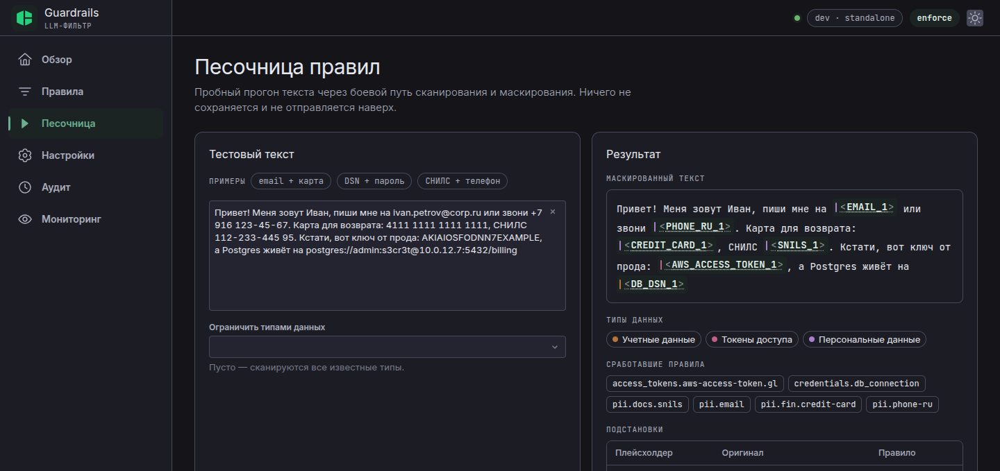
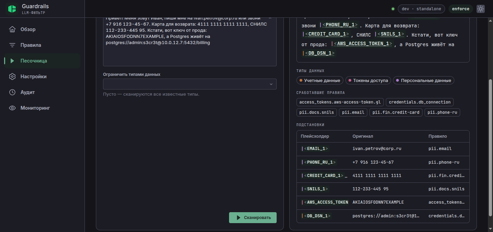
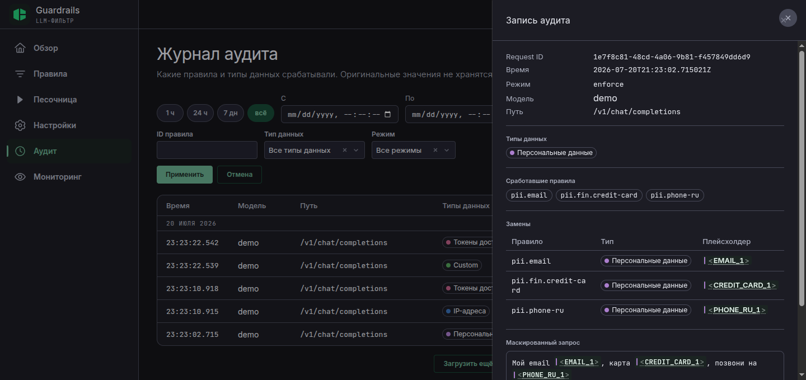
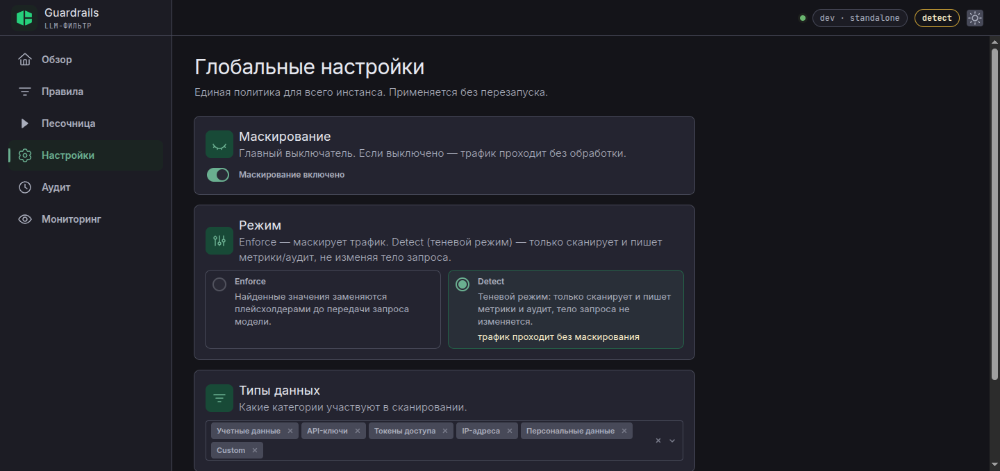
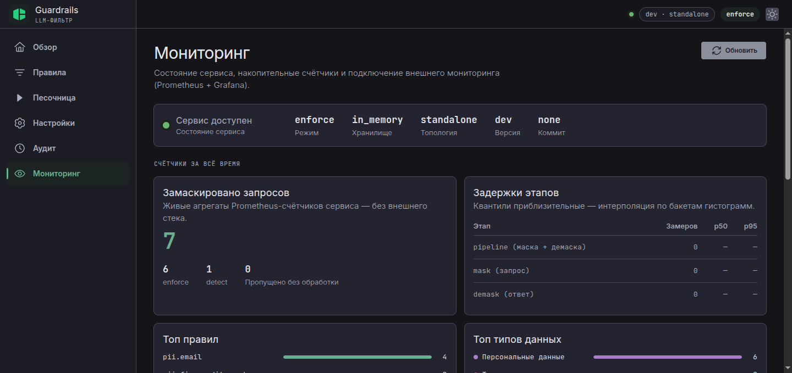

import Callout from '../../components/article/Callout.astro';
import QuantCard from '../../components/article/QuantCard.astro';
import StepList from '../../components/article/StepList.astro';
import Mermaid from '../../components/article/Mermaid';

# Guardrails LLM Filter: чтобы твои секреты не уехали к LLM-провайдеру 🛡️🔑

Ну чё, малютки, признавайтесь: кто хоть раз кидал в чатик с LLM кусок лога с боевым токеном? Или письмо клиента с его телефоном и картой — «перепиши повежливее»? Всё это уезжает провайдеру, оседает в логах на чужой стороне, а у безопасников дёргается глаз. А если у тебя ещё и агенты сами собирают контекст из базы и тикетов — ты вообще не контролируешь, что улетает в промпт.

Сегодня щупаем **guardrails-llm-filter** от Cloud.ru — открытый прокси, который решает ровно эту боль. Я его собрал, запустил демо, скормил ему фейковые карты и СНИЛСы и наделал скриншотов — всё покажу.

<Callout type="fire" title="Суть за 10 секунд">
**guardrails-llm-filter** — прозрачный reverse-proxy между твоим приложением и LLM-провайдером. По пути к модели ~265 regex-правил заменяют PII и секреты на плейсхолдеры вида <code>&lt;EMAIL_1&gt;</code>, а в ответе возвращают оригиналы. Модель никогда не видит чувствительные данные, клиент никогда не видит заглушки. Один Go-бинарь, в приложении меняется только base URL. Лицензия **Apache 2.0**.
</Callout>

<QuantCard title="Apache 2.0" badge="Лицензия" badgeColor="#10b981">
Открытый код, один Go-бинарь без внешних зависимостей. Каталог правил секретов — производный от gitleaks.
</QuantCard>

<QuantCard title="~265 правил" badge="Детекция" badgeColor="#7c3aed">
Ключи API, токены, учётки БД, карты, IBAN — и российские PII: СНИЛС, ИНН, ОГРН с проверкой контрольных сумм.
</QuantCard>

<QuantCard title="F1 93.1" badge="pii-bench" badgeColor="#f59e0b">
Precision 99.9% на hivetrace/pii-bench — выше, чем у ML-пайплайна GLiNER Guard (84.4). И это чистые regex + валидаторы.
</QuantCard>

---

## Как это работает

Идея наглая в своей простоте. Клиент ходит не к провайдеру, а к прокси. Тот сканирует запрос, меняет находки на плейсхолдеры, шлёт наверх. Ответ провайдера сканируется в обратную сторону — плейсхолдеры меняются на оригиналы. Таблица «заглушка → оригинал» живёт в памяти процесса ровно столько, сколько живёт запрос:

<Mermaid client:visible caption="Весь путь — в одном обработчике: замаскировал, переслал, восстановил." chart={`sequenceDiagram
  participant C as Клиент
  participant G as guardrails-llm-filter
  participant P as LLM-провайдер
  C->>G: "пиши на ivan@corp.ru, карта 4111 ..."
  Note over G: ~265 regex-правил +<br/>контрольные суммы
  G->>P: "пиши на <EMAIL_1>, карта <CREDIT_CARD_1>"
  P-->>G: ответ с плейсхолдерами (JSON или SSE)
  Note over G: демаскирование: целиком<br/>или по SSE-кадрам
  G-->>C: ответ с оригиналами
`} />

Ключевые свойства, за которые лично я ставлю плюсики:

<StepList steps={[
	{ num: "1", text: "<strong>Drop-in.</strong> В приложении меняется только base URL. OpenAI (<code>/v1/chat/completions</code>, <code>/v1/responses</code>) и Anthropic (<code>/v1/messages</code>) — из коробки, JSON и стриминг." },
	{ num: "2", text: "<strong>Двусторонность.</strong> Большинство инструментов «замазали и забыли» (у Portkey редакция вообще irreversible by design). Тут оригиналы возвращаются в ответ, в том числе в аргументах tool-call." },
	{ num: "3", text: "<strong>Без ML на data-path.</strong> Regex + валидаторы контрольных сумм — микросекунды на запрос, никаких внешних вызовов и GPU." },
	{ num: "4", text: "<strong>Fail-open.</strong> Любая внутренняя ошибка пропускает трафик, а не кладёт его. Запросы никогда не блокируются — сервис только маскирует." },
	{ num: "5", text: "<strong>Российские PII.</strong> СНИЛС/ИНН/ОГРН с контрольными суммами — из западных тулов такого нет ни у кого." },
]} />

---

## Запускаем: демо без реального провайдера

В репе лежит готовый quickstart с фейковым LLM, который отвечает эхом — самое то, чтобы увидеть обе стороны маскирования:

```bash
git clone https://github.com/cloud-ru-tech/guardrails-llm-filter
cd guardrails-llm-filter/examples/quickstart
docker compose up --build
```

Шлём запрос с email, картой и телефоном — как обычному OpenAI-совместимому API, только на `:8080`:

```bash
curl -sS http://localhost:8080/v1/chat/completions \
  -H 'Content-Type: application/json' \
  -d '{"model":"demo","messages":[{"role":"user","content":"Мой email john.doe@example.com, карта 4111 1111 1111 1111, позвони на +7 916 123-45-67"}]}'
```

Клиенту возвращается ответ с **оригиналами** — как будто прокси и нет:

```json
{"choices":[{"message":{"content":"You said: Мой email john.doe@example.com, карта 4111 1111 1111 1111, позвони на +7 916 123-45-67"}}]}
```

А теперь смотрим, что получила «модель» (логи mock-llm):

```
mock-llm received (as the LLM sees it):
  "Мой email <EMAIL_1>, карта <CREDIT_CARD_1>, позвони на <PHONE_RU_1>"
```

Накидал ещё запросов позлее — СНИЛС, ИНН, ключ AWS, DSN от Postgres:

```
"СНИЛС <SNILS_1>, ИНН <INN_ORG_1>, вот ключ sk-proj-abc123... и IP <IPV4_1>"
"Пиши на <EMAIL_1>, AWS ключ <AWS_ACCESS_TOKEN_1>"
```

Стриминг тоже проверил. Шлём с `"stream": true` — клиенту прилетают обычные SSE-чанки с **оригиналом** внутри:

```
data: {..."delta":{"content":"You said: "}...}
data: {..."delta":{"content":"Пиши на jane@corp.ru"}...}
data: [DONE]
```

А в логах mock-llm — `"Пиши на <EMAIL_1>"`. Демаскирование отработало прямо по SSE-кадрам: модель оригинала так и не увидела.

<Callout type="warning" title="Не всё ловится из коробки">
Заметил глазастый? Фейковый OpenAI-ключ <code>sk-proj-...</code> в моём тесте прошёл к модели <strong>немаскированным</strong> — а вот номер счёта рядом поймало общее правило <code>generic-long-token</code>. Мораль: каталог из 265 правил широкий, но не всеядный. Перед продом прогони свои реальные форматы данных через песочницу (о ней ниже) и добей дырки кастомными правилами.
</Callout>

---

## Веб-консоль: вшита прямо в бинарь

На `:9080` живёт management-консоль — TypeScript/React SPA, запечённая в тот же Go-бинарь через `go:embed`. Отдельного веб-сервера нет, CORS нет, деплоить нечего. Вот дашборд после моих экспериментов:



Видно всё, что я натворил: 5 замаскированных запросов, разбивка по типам данных, топ правил — от `pii.email` до моего кастомного `acme_token`.

### Правила: 265 встроенных + свои



Каждое правило включается/выключается тумблером, есть импорт/экспорт и фильтры. Кастомное правило добавляется одним POST — я завёл детект внутреннего токена:

```bash
curl -X POST http://localhost:9080/v1/rules \
  -H 'Content-Type: application/json' \
  -d '{
    "rule_id": "acme_token",
    "name": "ACME internal token",
    "data_type": 6,
    "regex": "\\bacme-[0-9a-f]{8}\\b",
    "masking": {"placeholder": "ACME_TOKEN"}
  }'
```

И следующий же запрос с `acme-deadbeef` ушёл к модели как `<ACME_TOKEN_1>`. Без рестарта, без передеплоя.

То же самое можно сделать мышкой — форма создания правила умеет больше, чем голый regex:



Обрати внимание на поля — это фактически конспект того, как устроен движок детекции:

<StepList steps={[
	{ num: "🔑", text: "<strong>Ключевые слова</strong> — регистронезависимый пре-фильтр: дорогая регулярка запускается, только если в тексте есть совпадение по словам. Так 265 правил и живут в микросекундах." },
	{ num: "✅", text: "<strong>Валидаторы</strong> — контрольные суммы (Luhn, СНИЛС, ИНН, ОГРН, IBAN) отсекают то, что похоже на номер карты, но им не является. Отсюда precision 99.9%." },
	{ num: "🎲", text: "<strong>Мин. энтропия и бан-лист</strong> — чтобы generic-правила для токенов не хватали слова типа <code>xxxxxxxx</code> или примеры из документации." },
	{ num: "🎯", text: "<strong>Группы захвата</strong> — можно маскировать не всё совпадение, а только часть (пароль в DSN, а не весь URL)." },
]} />

А вкладка «Активный набор» показывает, что *реально* участвует в сканировании: встроенные ∪ пользовательские − отключённые, сгруппированные по типам данных. Плюс импорт/экспорт всего набора файлом — удобно таскать политику между инстансами.

### Песочница: прогон через боевой путь

Самая полезная страница для отладки: вставляешь текст, и настоящий пайплайн сканирования показывает, что было бы замаскировано:



Ниже — таблица подстановок: какой плейсхолдер, что за оригинал, какое правило сработало. Email, телефон, карта (Luhn сошёлся), СНИЛС (контрольная сумма сошлась), AWS-ключ и полный DSN Postgres с паролем:



### Аудит: кто, что и когда

С включённым аудитом (`GUARDRAILS_AUDIT_ENABLED=true`) каждая маскировка пишется в журнал. В детали записи видно сработавшие правила и маскированные тексты запроса/ответа — то есть ровно то, что реально увидел провайдер:



### Настройки: enforce → detect без рестарта

Глобальная политика инстанса: главный рубильник маскирования, режим и список сканируемых типов данных. Применяется сразу, без перезапуска:



Самое интересное тут — **Detect**, он же теневой режим. Я переключил его прямо в консоли и повторил запрос с email и картой. Результат:

- mock-LLM получил **оригинальный текст** — трафик не тронут;
- в аудите появилась запись с `mode: detect` и списком правил, которые *сработали бы*: `pii.email`, `pii.fin.credit-card`.

Отсюда и сценарий внедрения: вешаешь прокси в detect, неделю-другую смотришь в «Обзоре», что и сколько маскировалось бы, чинишь ложные срабатывания — и щёлкаешь в enforce одним PUT-запросом:

```bash
curl -X PUT http://localhost:9080/v1/settings \
  -H 'Content-Type: application/json' \
  -d '{"enabled":true,"data_types":[1,2,3,4,5,6],"mode":"enforce"}'
```

### Мониторинг: живые счётчики без внешнего стека

Страница «Мониторинг» показывает агрегаты Prometheus-счётчиков самого сервиса — без Grafana и вообще без чего-либо внешнего: режим, хранилище, топология, версия, счётчики enforce/detect и задержки этапов mask/demask:



Для взрослого сетапа есть голый Prometheus-эндпоинт на `:9090/metrics` (неймспейс `extproc_guardrails`) и готовый дашборд Grafana в репе:

```
extproc_guardrails_data_type_triggers_total{data_type="PERSONAL_DATA"} 5
extproc_guardrails_data_type_triggers_total{data_type="ACCESS_TOKENS"} 2
extproc_guardrails_demask_duration_seconds_bucket{le="0.001"} ...
```

<Callout type="warning" title="Консоль — не наружу">
Config API на <code>:9080</code> — <strong>без аутентификации</strong>. Задумка такая: консоль живёт только во внутренней сети/кластере, никогда не публичный ingress. И ещё нюанс из чеклиста безопасности: data-plane понимает override-заголовок <code>x-guardrails-data-types</code>, которым можно ослабить маскирование для запроса — если перед прокси стоит недоверенный клиентский трафик, фронтовый шлюз должен этот заголовок вырезать. Не повторяйте мой <code>docker compose up</code> на VPS с публичным IP.
</Callout>

---

## Что под капотом

<StepList steps={[
	{ num: "⚙️", text: "<strong>Один Go-бинарь.</strong> Data-plane на <code>:8080</code>, config API + консоль на <code>:9080</code>, метрики Prometheus на <code>:9090</code>, gRPC-управление на <code>:9000</code>." },
	{ num: "🧠", text: "<strong>Хранилище по вкусу:</strong> in-memory (дефолт, одна реплика), Redis или Postgres — для нескольких реплик. Для прохождения трафика хранилище вообще не нужно: карта замен живёт в памяти запроса." },
	{ num: "☸️", text: "<strong>Деплой:</strong> multi-stage Dockerfile (distroless, non-root), kustomize-база для Kubernetes, пробы <code>/healthz</code> и <code>/readyz</code>. Несколько реплик — через общее хранилище, изменения политики разъезжаются тикерами за ~30 секунд." },
	{ num: "📊", text: "<strong>Аудит-трейл:</strong> retention 24h по умолчанию, записи асинхронные и fail-open, опциональное шифрование чувствительного контента (AES-256-GCM)." },
	{ num: "🔌", text: "<strong>Родственник для Envoy:</strong> тот же движок есть в форме gRPC-сайдкара <code>ext_proc</code> — проект guardrails-llm-filter-extproc." },
]} />

Конфигурация — переменные окружения с префиксом `GUARDRAILS_`, обычно хватает одной:

```bash
docker run --rm -p 8080:8080 -p 9080:9080 \
  -e GUARDRAILS_UPSTREAM_BASE_URL=https://api.openai.com \
  ghcr.io/cloud-ru-tech/guardrails-llm-filter:latest
```

---

## А точно regex вывозит против ML?

Главный скепсис к regex-детекции: «ну это же прошлый век, сейчас все гоняют NER-модели». Авторы померили свой пайплайн на публичном датасете [hivetrace/pii-bench](https://huggingface.co/datasets/hivetrace/pii-bench) (1810 примеров, 13 типов ПДн):

| Подход | F1 | precision |
|---|:--:|:--:|
| **guardrails-llm-filter** (regex + чексуммы) | **93.1** | **99.9** |
| GLiNER Guard pipeline (модель + regex) | 84.4 | — |
| GLiNER Omni, чистая модель | 72.8 | — |

Пуант в том, что сырые ML-модели проваливаются ровно на структурированном PII — ИНН, ОГРН, карты — и в продакшн-режиме добирают качество… теми же regex-правилами. А для свободного текста («меня зовут Иван Петров, живу на Ленина 5») наоборот — regex слепой, тут нужен NER типа Presidio. Для трафика агентов и приложений, где чувствительное — это в основном ключи, токены и документы с чексуммами, regex-подход честно выигрывает: быстрее, дешевле и предсказуемее.

---

## Когда брать, когда нет

<Callout type="tip" title="Мой вердикт">
<strong>Брать</strong>, если гоняешь корпоративный трафик через внешнего LLM-провайдера и надо, чтобы PII и секреты не покидали контур — особенно с российскими документами, которые западные тулы не знают в принципе. Один бинарь, поменял base URL — и работает.<br/><br/>
<strong>Не брать</strong>, если нужна защита от джейлбрейков и контроль тем разговора (это к NeMo Guardrails), полновесный AI-шлюз с роутингом и бюджетами (LiteLLM/Portkey) или ML-NER для свободного текста на куче языков (Presidio).
</Callout>

Отдельный кайф для агентных сетапов: агент сам тащит в контекст логи, тикеты, куски базы — и ты не контролируешь, что окажется в промпте. Прокси на пути к провайдеру — последний рубеж, который отработает независимо от того, насколько дырявый у тебя <a href="/blog/agent-harness/">харнес</a>.

---

## TL;DR

<StepList steps={[
	{ num: "1", text: "<strong>Что:</strong> открытый (Apache 2.0) reverse-proxy от Cloud.ru — маскирует PII/секреты по пути к LLM, возвращает оригиналы в ответе, включая SSE-стрим" },
	{ num: "2", text: "<strong>Как:</strong> ~265 regex-правил + контрольные суммы (Luhn, СНИЛС, ИНН, ОГРН), микросекунды на запрос, без ML на data-path, fail-open" },
	{ num: "3", text: "<strong>Фишки:</strong> веб-консоль в бинаре (обзор, правила, песочница, настройки, аудит, мониторинг), shadow-режим с переключением на лету, кастомные правила через API/UI, Prometheus + Grafana" },
	{ num: "4", text: "<strong>Но:</strong> каталог правил не всеядный (мой sk-proj-ключ прошёл к модели) — проверь свои форматы в песочнице; config API без аутентификации — только во внутренней сети" },
]} />

Запустить демо — три команды, полчаса вечера. А дальше сам решай, готов ли ты и дальше отправлять номера карт клиентов в чужие дата-центры. 🫡
