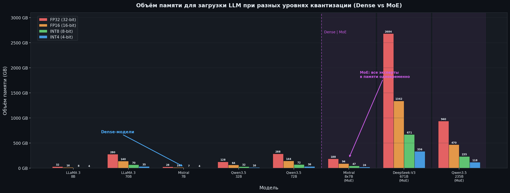
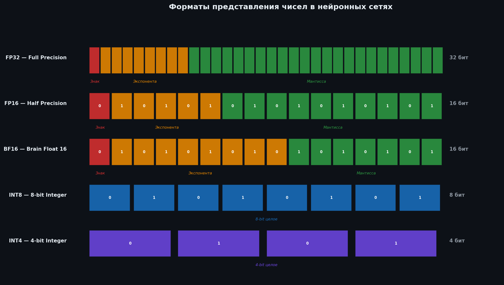
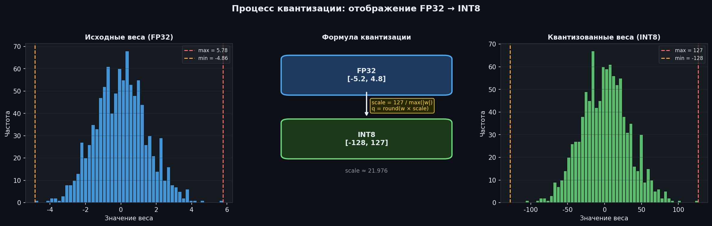
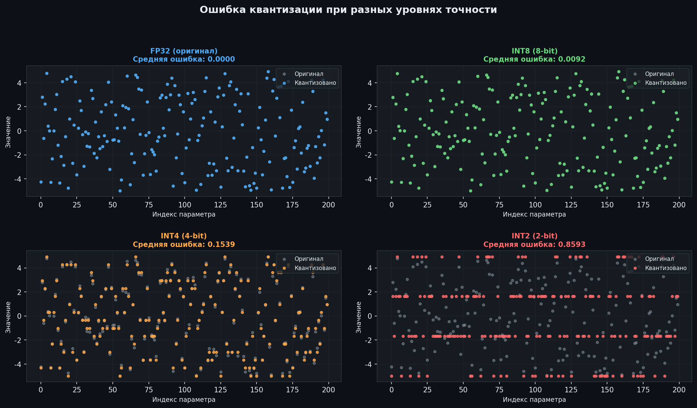
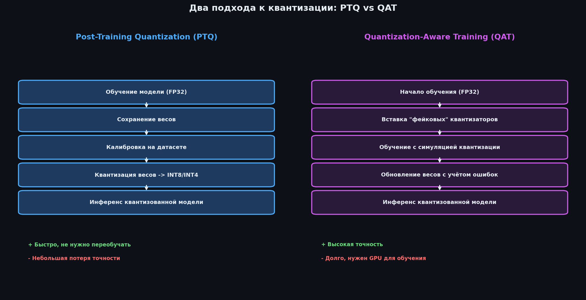
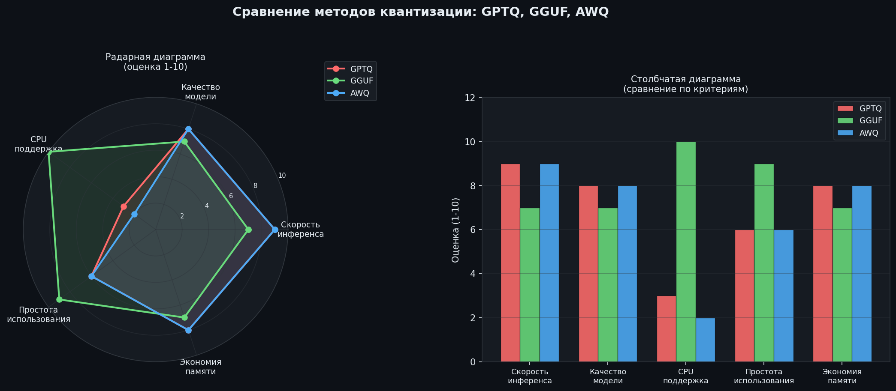
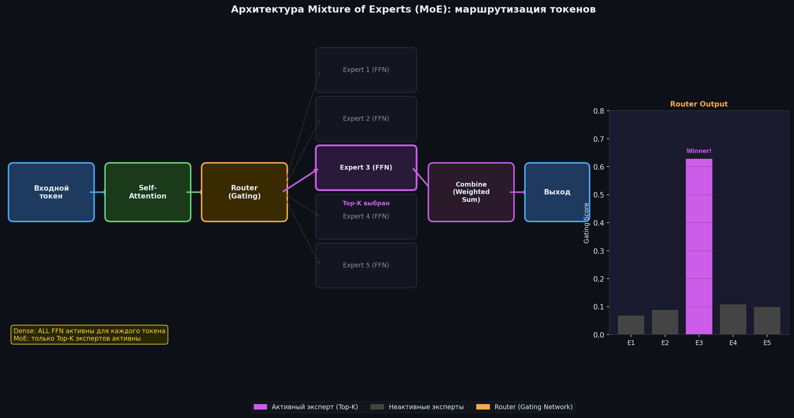
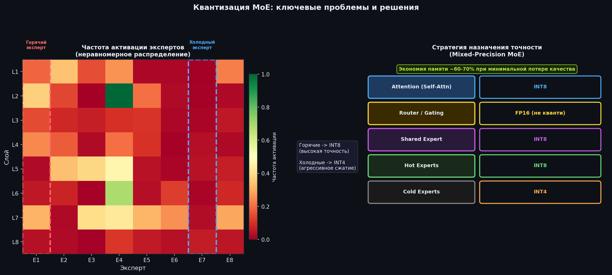

import Callout from '../../components/article/Callout.astro';
import QuantCard from '../../components/article/QuantCard.astro';
import MemoryBar from '../../components/article/MemoryBar.astro';
import StepList from '../../components/article/StepList.astro';
import VramCalculator from '../../components/article/VramCalculator';

# Квантизация LLM: Как запихнуть 70B модель в твою видюху 🫡

Ну чё, малютки, думаете что для запуска **LLaMA 3 70B** вам нужна серверная стойка за лярд рублей? Поздравляю, вас обманули маркетологи GPU-вендоров. Модели с сотнями миллиардов параметров — **LLaMA 3 70B**, **DeepSeek-V3** с его 671 лярдом параметров — жрут VRAM как не в себя. Но есть способ запихнуть это всё в обычную потребительскую видюху.

<Callout type="fire" title="Суть за 5 секунд">
**Квантизация** — сжимаем модель в 4–8 раз, теряем минимум качества. Это как JPEG для нейросетей — выглядит почти так же, весит в разы меньше. Без этого трюка LLM на обычном железе — фантастика.
</Callout>

Короче, в этом посте я разложу по полочкам: что такое квантизация, как она работает под капотом, какие форматы существуют, почему **MoE-модели** — это отдельная головная боль, и покажу как всё это гонять на практике с кодом.

---

## Что за квантизация и нахуя она нужна?

Смотри, малютки. Каждый параметр модели — это число. По дефолту оно хранится как FP32 (32-битное число с плавающей запятой) — **4 байта** на один параметр. Квантизация — это когда мы берём и говорим: «а давай хранить это число не в 32 битах, а в 8 или даже 4». Точность падает, но модель продолжает работать. Магия? Нет, математика.

<Callout type="info" title="Аналогия для тех, кто не в теме">
_Представь, что ты сжимаешь фотку в JPEG. Пиксели теряют часть цветовой информации, файл весит в 10 раз меньше, а глазом разницу хрен заметишь. Квантизация — то же самое, только для весов нейросети._
</Callout>

### Сколько памяти это реально экономит?

Малютки, вот вам наглядно — **LLaMA 3 70B** при разной точности:

<MemoryBar label="FP32 (полная точность)" value={280} max={280} color="linear-gradient(90deg, #ef4444, #dc2626)" />
<MemoryBar label="FP16 (половинная)" value={140} max={280} color="linear-gradient(90deg, #f59e0b, #d97706)" />
<MemoryBar label="INT8" value={70} max={280} color="linear-gradient(90deg, #3b82f6, #2563eb)" />
<MemoryBar label="INT4" value={35} max={280} color="linear-gradient(90deg, #10b981, #059669)" />

Для MoE-моделей типа ДикойПсины (DeepSeek-V3, 671B) квантизация — это вообще вопрос жизни и смерти. Без неё модель жрёт **2600+ ГБ** памяти. Кек.



<VramCalculator client:load />

---

## Как это работает под капотом?

Ладно, малютки, давайте разберёмся что там внутри. Сначала — форматы данных, без них никуда.

### Форматы данных: от жирного FP32 до худого INT4

<div class="grid-2" style="margin: 1.5em 0;">
<QuantCard title="FP32" badge="32 бит" badgeColor="#ef4444">
Жирный дефолт. **4 байта** на параметр. Максимальная точность, максимальный жор памяти. Для инференса — оверкилл.
</QuantCard>

<QuantCard title="FP16" badge="16 бит" badgeColor="#f59e0b">
Вдвое легче. Диапазон поменьше, но для инференса хватает за глаза. Стандарт для большинства тачек.
</QuantCard>

<QuantCard title="BF16" badge="16 бит" badgeColor="#8b5cf6">
Хитрый формат — сохраняет динамический диапазон FP32, жертвуя точностью. Любимец тех, кто обучает модели.
</QuantCard>

<QuantCard title="INT8 / INT4" badge="8–4 бит" badgeColor="#10b981">
Максимальное сжатие. Тут уже нужны спецтехники, чтобы модель не превратилась в мусор. Но если всё сделать правильно — годнота.
</QuantCard>
</div>



### Как именно происходит сжатие

Окей, малютки, теперь самое вкусное. Квантизация — это маппинг диапазона значений из FP32 в более компактный формат. Самый базовый метод — **линейная квантизация**:

<StepList steps={[
	{ num: "1", text: "Находятся <strong>минимальное и максимальное</strong> значения весов в исходном формате FP32" },
	{ num: "2", text: "Диапазон <strong>линейно отображается</strong> на целевой формат (например, −128…127 для INT8)" },
	{ num: "3", text: "Вычисляется <strong>коэффициент масштабирования</strong> (scale)" },
	{ num: "4", text: "Каждое значение <strong>умножается на scale</strong> и округляется до ближайшего целого" },
]} />



<Callout type="warning" title="⚠️ Ошибка квантизации">
Процесс необратимый — информация теряется. Чем меньше бит, тем больше потери. Современные методы типа GPTQ и AWQ используют хитрые алгоритмы, чтобы минимизировать эту ошибку, но полностью избежать её нельзя. _Такова цена дешёвого инференса._
</Callout>



---

## PTQ vs QAT: два подхода, две судьбы

<div class="grid-2" style="margin: 1.5em 0;">
<QuantCard title="Post-Training Quantization (PTQ)" badge="Быстро и дёшево" badgeColor="#3b82f6">
Берём готовую модель → конвертим веса в INT8/INT4. Не нужно переобучение, не нужны тачки с кучей GPU. Минус — при агрессивном сжатии до 4 бит качество может просесть. Но для большинства задач — топ.
</QuantCard>

<QuantCard title="Quantization-Aware Training (QAT)" badge="Дорого, но точно" badgeColor="#10b981">
Модель **учится жить** с низкой точностью прямо во время тренировки. Нужны GPU, время и терпение. Зато на выходе — лучшее качество при том же уровне сжатия. Если есть ресурсы — однозначно стоит.
</QuantCard>
</div>



---

## Форматы квантизации: GPTQ, GGUF, AWQ — что выбрать?

Ладно, малютки, теория — это хорошо, но на практике вам придётся выбирать между конкретными форматами. Вот что есть:

| Метод | Основное применение | Плюсы | Минусы |
| :--- | :--- | :--- | :--- |
| **GPTQ** | Быстрый инференс на GPU | Высокая скорость, хорошая точность | Плохая поддержка CPU |
| **GGUF** | CPU и GPU (гибридный режим) | Отличная поддержка CPU, простота | Может быть медленнее GPTQ на GPU |
| **AWQ** | Инференс на GPU | Высокая скорость и точность | Менее распространён |

<Callout type="tip" title="Короче, что выбрать">
Гоняешь на CPU или хочешь гибрид CPU+GPU? → **GGUF** (llama.cpp, Ollama, LM Studio). Нужна максимальная скорость на GPU? → **GPTQ** или **AWQ**. Не усложняй.
</Callout>



---

## MoE-модели: отдельная головная боль 🗑️🔥

Малютки, если вы думали что квантизация dense-моделей — это сложно, то добро пожаловать в мир **Mixture of Experts (MoE)**. Это когда модель содержит кучу специализированных «экспертных» подсетей, но для каждого токена активирует только парочку из них. Звучит эффективно? Ну, есть нюансы.

<Callout type="info" title="Кто использует MoE">
**Mixtral 8x7B** (Mistral AI), **DeepSeek-V3** (671B, активно ~37B), **Qwen3.5-235B** (активно ~22B), **LLaMA 4 Scout** (109B, активно ~17B) — все топовые модели последнего года.
</Callout>

### Как работает эта штука

В каждом слое трансформера вместо одного FFN-блока — набор экспертов и **Router** (маршрутизатор). Router смотрит на токен и решает: «тебе к эксперту №3 и №7». Top-K экспертов обрабатывают токен, остальные сидят без дела.



### Почему квантизация MoE — это боль

<Callout type="fire" title="Вот в чём засада">
MoE активирует только часть экспертов, но **ВСЕ веса ВСЕХ экспертов должны сидеть в памяти одновременно**. ДикаяПсина V3 с 671 лярдом параметров — все 671 лярд должны быть в VRAM. Квантизация тут не опция, а единственный шанс на жизнь.
</Callout>

<div class="grid-2" style="margin: 1.5em 0;">
<QuantCard title="🔥 Неравномерная активация" badge="Проблема" badgeColor="#ef4444">
Одни эксперты пашут как проклятые (hot), другие сидят без дела (cold). Если агрессивно квантизовать «горячих» — качество просядет непропорционально. Решение — **mixed-precision**: hot → INT8, cold → INT4.
</QuantCard>

<QuantCard title="🎯 Router — не трогай!" badge="Проблема" badgeColor="#ef4444">
Router принимает дискретные решения: «этот токен — к эксперту №5». Даже мелкая ошибка квантизации может отправить токен не к тому эксперту. Поэтому **Router не квантизуют** — оставляют в FP16.
</QuantCard>

<QuantCard title="📊 Калибровка — лотерея" badge="Проблема" badgeColor="#f59e0b">
PTQ требует калибровочный датасет. Но если редкий эксперт не встретился в выборке — его коэффициенты будут мусором. Решение — **per-expert sampling**, но это доп. геморрой.
</QuantCard>

<QuantCard title="📐 Каждый слой — уникальная снежинка" badge="Нюанс" badgeColor="#8b5cf6">
Даже внутри одного MoE-блока разные линейные слои по-разному переносят квантизацию. Оптимум — **разная битность для каждой матрицы весов**. Да, это сложно. Да, это работает.
</QuantCard>
</div>



### Моя шпаргалка по квантизации MoE

| Компонент | Точность | Обоснование |
| :--- | :--- | :--- |
| **Attention** | INT8 | Умеренная чувствительность |
| **Router / Gating** | FP16 | Критичен для маршрутизации |
| **Shared Expert** | INT8 | Всегда активен |
| **Hot Experts** | INT8 | Частая активация |
| **Cold Experts** | INT4 | Редкая активация |

<Callout type="tip" title="Что это даёт на практике">
Экономия памяти **60–70%** при минимальной потере качества. ДикаяПсина V3 в INT4 — ~336 ГБ вместо 2684 ГБ в FP32. Разница в **8 раз**. Это уже реально запустить на кластере из нескольких тачек, а не на целом дата-центре.
</Callout>

---

## Хватит теории — давай код 🔥

Ну чё, малютки, хватит лекций. Самый простой способ пощупать квантизацию руками — `bitsandbytes` + `transformers` от Hugging Face. Три строчки конфига — и модель жмётся в 4 бита.

```python
import torch
from transformers import AutoModelForCausalLM, AutoTokenizer, BitsAndBytesConfig

model_id = "mistralai/Mistral-7B-Instruct-v0.2"

quantization_config = BitsAndBytesConfig(
    load_in_4bit=True,
    bnb_4bit_compute_dtype=torch.bfloat16,
    bnb_4bit_quant_type="nf4",
    bnb_4bit_use_double_quant=True,
)

tokenizer = AutoTokenizer.from_pretrained(model_id)

model = AutoModelForCausalLM.from_pretrained(
    model_id,
    quantization_config=quantization_config,
    device_map="auto",
)

prompt = "Расскажи мне короткую историю о роботе, который мечтал стать художником."
inputs = tokenizer(prompt, return_tensors="pt").to(model.device)

outputs = model.generate(**inputs, max_new_tokens=150)
print(tokenizer.decode(outputs[0], skip_special_tokens=True))
```

<Callout type="tip" title="Что получаем">
**Mistral 7B** с NF4-квантизацией влезает в **~5–6 ГБ VRAM** вместо ~28 ГБ в FP32. Это RTX 3060, малютки. Обычная геймерская видюха.
</Callout>

Для MoE-моделей — всё то же самое:

```python
model_id = "mistralai/Mixtral-8x7B-Instruct-v0.1"

model = AutoModelForCausalLM.from_pretrained(
    model_id,
    quantization_config=quantization_config,
    device_map="auto",
)
# Без квантизации: ~94 GB VRAM (FP16)
# С INT4 квантизацией: ~24 GB VRAM
```

Ставим зависимости:

```bash
pip install transformers bitsandbytes accelerate
```

---

## Где брать готовые квантизованные модели?

Лень квантизовать самому? Понимаю. Вот где взять готовое:

<div style="display: flex; flex-direction: column; gap: 0.75rem; margin: 1.5em 0;">
<QuantCard title="🤗 Hugging Face Hub" badge="Главный склад" badgeColor="#f59e0b">
Ищи репозитории от **TheBloke** — этот чел наквантизовал практически все популярные модели в GGUF, GPTQ и AWQ. Самый большой каталог готовых квантов в открытом доступе. Просто бери и гоняй.
</QuantCard>

<QuantCard title="🦙 Ollama" badge="Для ленивых" badgeColor="#10b981">
`ollama run mixtral` — одна команда и модель уже работает. Встроенная библиотека с готовыми квантами. Идеально, если не хочешь разбираться в форматах и конфигах.
</QuantCard>

<QuantCard title="🖥️ LM Studio" badge="GUI для людей" badgeColor="#3b82f6">
Графический интерфейс — скачал, запустил, общаешься с моделью. Встроенный поиск по Hugging Face, управление моделями и чат. Для тех, кто не хочет открывать терминал.
</QuantCard>
</div>

### Как читать названия файлов (чтобы не скачать мусор)

| Суффикс | Описание | Рекомендация |
| :--- | :--- | :--- |
| `Q2_K` | 2-битная, очень агрессивная | Только для слабого железа |
| `Q4_K_M` | 4-битная, сбалансированная | **Лучший выбор для большинства** |
| `Q5_K_M` | 5-битная, высокое качество | Если есть запас VRAM |
| `Q8_0` | 8-битная, почти без потерь | Для максимального качества |

---

## Итого, малютки 🫡

<Callout type="fire" title="Главный вывод">
Квантизация — это то, что делает LLM доступными не только корпорациям с лярдами на GPU. Для **dense-моделей** — экономия памяти в 4–8 раз. Для **MoE-моделей** — единственный способ запустить гигантов типа ДикойПсины V3 на чём-то, что не стоит как квартира в Москве.
</Callout>

Если честно, квантизация — одна из самых недооценённых тем в ML. Все гонятся за новыми архитектурами и лярдами параметров, а реальный прорыв в доступности LLM — вот он, в умном сжатии весов. Разобрались в форматах, поняли нюансы MoE, знаете где брать готовое — теперь можете гонять модели на своём ноутбуке. Вперёд, малютки.

---

### Источники

1. [A Visual Guide to Quantization — Maarten Grootendorst](https://newsletter.maartengrootendorst.com/p/a-visual-guide-to-quantization)
2. [Quantization for Large Language Models — DataCamp](https://www.datacamp.com/tutorial/quantization-for-large-language-models)
3. [What new challenges does the MoE architecture introduce for LLM quantization? — Medium](https://medium.com/@yangwq177/what-new-challenges-does-the-moe-architecture-introduce-for-the-quantization-of-large-language-243ef2812a72)
4. [Examining Post-Training Quantization for Mixture-of-Experts — arXiv](https://arxiv.org/html/2406.08155v1)
5. [TheBloke on Hugging Face](https://huggingface.co/TheBloke)
