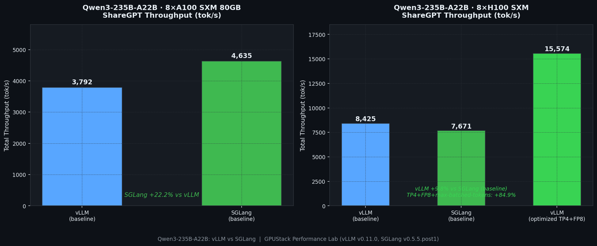
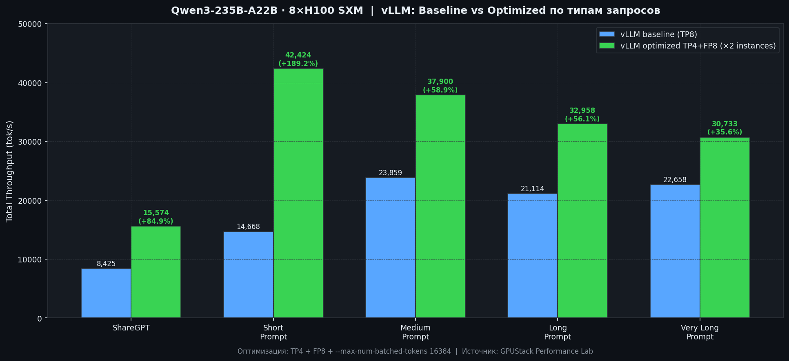
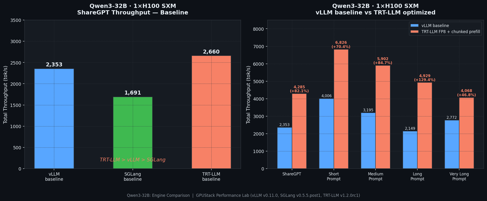
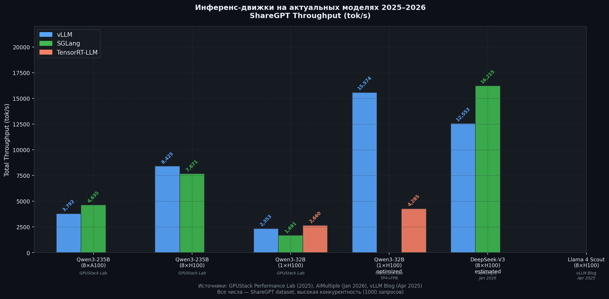
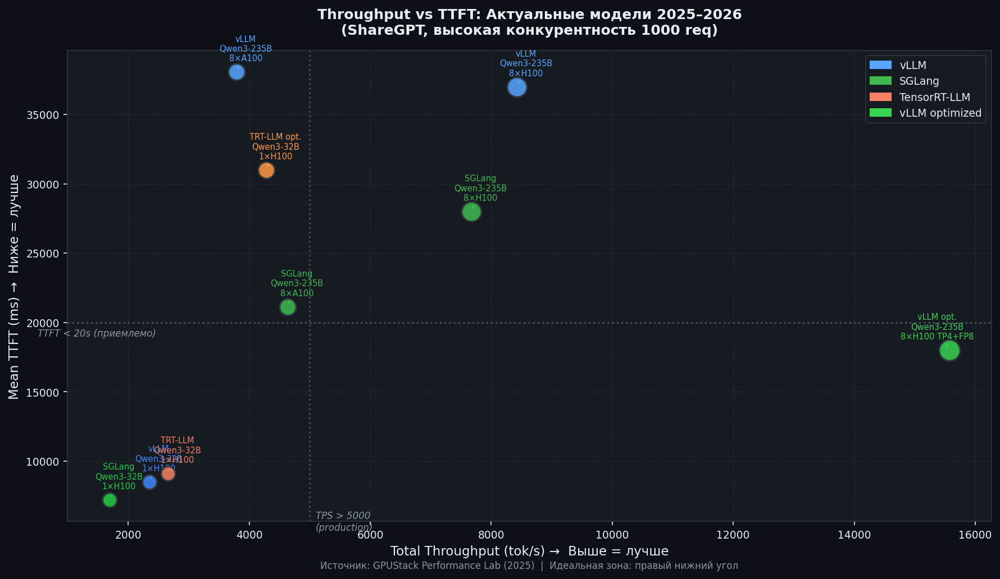
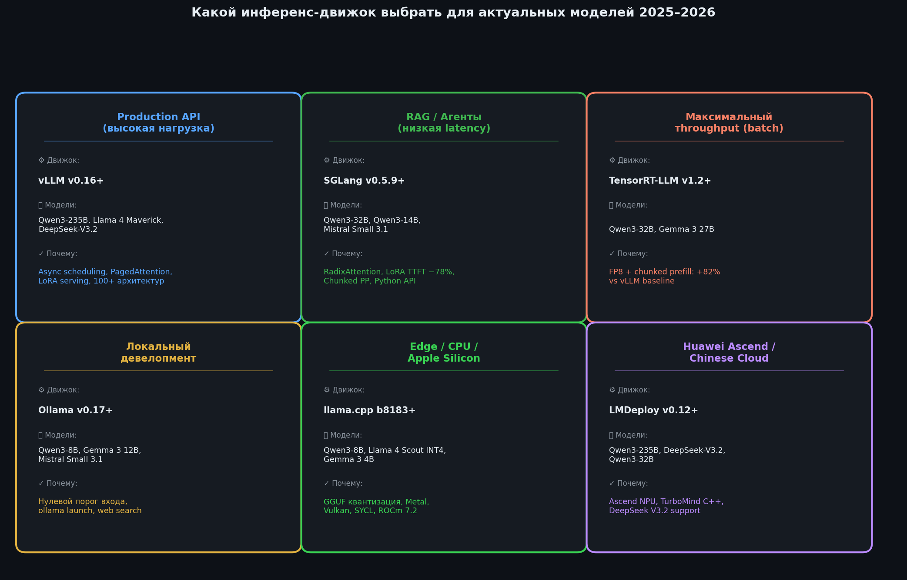
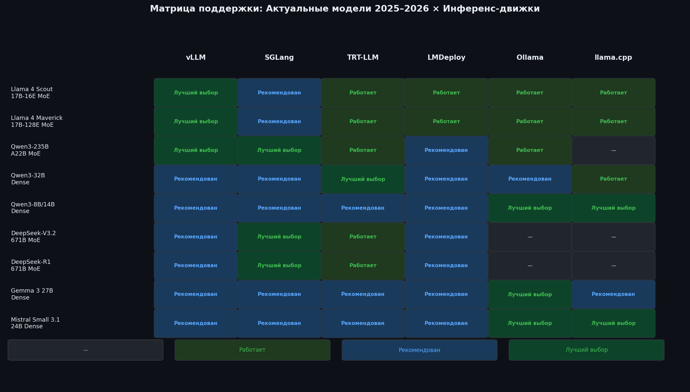
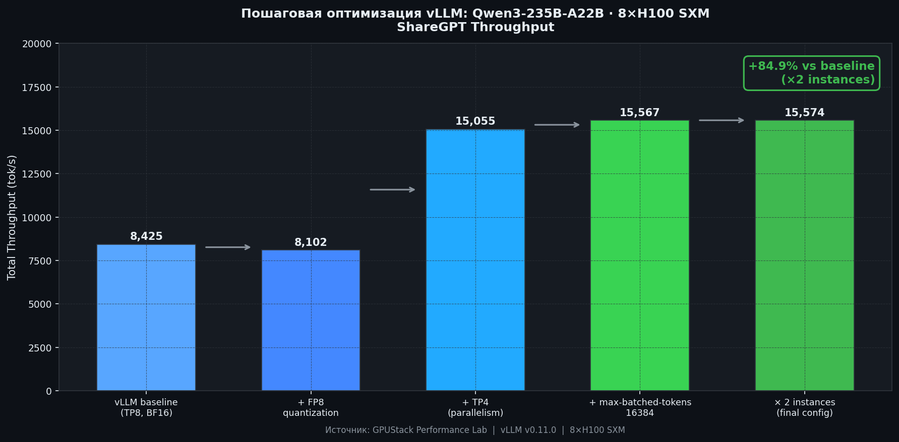

import Callout from '../../components/article/Callout.astro';
import QuantCard from '../../components/article/QuantCard.astro';
import MemoryBar from '../../components/article/MemoryBar.astro';
import StepList from '../../components/article/StepList.astro';
import EngineCompare from '../../components/article/EngineCompare';
import InferenceBenchmark from '../../components/article/InferenceBenchmark';
import EngineDecisionTree from '../../components/article/EngineDecisionTree';
import PagedAttentionDemo from '../../components/article/PagedAttentionDemo';
import PlatformMatrix from '../../components/article/PlatformMatrix';
import ThroughputCalculator from '../../components/article/ThroughputCalculator';

# Инференс-движки для LLM: Как перестать гонять модели через transformers и начать жить 🫡

Ну чё, малютки, думаете что запустить LLM — это `model.generate()` и готово? Поздравляю, вас обманули туториалы с Hugging Face 🫡 Когда к твоему сервису приходят сотни юзеров одновременно, наивный подход через `transformers` разваливается как карточный домик: GPU простаивает между запросами, KV-кэш не переиспользуется, память жрётся как будто её бесконечно. _Это как пытаться обслужить ресторан на 200 мест одной микроволновкой._

<Callout type="fire" title="Суть за 10 секунд">
Специализированные инференс-движки — **vLLM, SGLang, LMDeploy, Ollama, llama.cpp** — решают все эти проблемы. Тут я разберу каждый движок, покажу бенчмарки на актуальных моделях 2025–2026, и дам пошаговые инструкции по установке на **Linux, Windows и macOS**. Без воды, с кодом.
</Callout>

Короче, в этом посте я разложу по полочкам: какие технологии делают инференс быстрым, какой движок для чего годится, покажу реальные цифры производительности, и дам копипастные команды для запуска на любой платформе. Поехали.

---

## Часть 1: Теория и Сравнение

### Нахуя вообще нужны эти движки? 🗑️🔥

Смотри, малютки. Запустить модель через `transformers` — это как ездить на Ferrari по дворам на первой передаче. Технически работает, но нахуя? Когда нужен production — наивный подход ломается. Специализированные движки решают проблемы через шесть ключевых технологий:

<StepList steps={[
	{ num: "1", text: "<strong>Continuous Batching</strong> — новые запросы влетают в батч на лету, без ожидания пока предыдущие допишут свои романы" },
	{ num: "2", text: "<strong>PagedAttention / RadixAttention</strong> — виртуальная память для KV-кэша. Как swap в ОС, только для внимания нейросети" },
	{ num: "3", text: "<strong>CUDA Graphs</strong> — компиляция графа вычислений, чтобы CUDA-ядра не тупили на каждом запуске" },
	{ num: "4", text: "<strong>Квантизация</strong> — INT4/INT8/FP8/NVFP4. Сжимаем веса, экономим VRAM, ускоряем вычисления. Подробнее — в моём посте про квантизацию" },
	{ num: "5", text: "<strong>Спекулятивное декодирование</strong> — маленькая модель генерит черновик, большая проверяет. Параллелизм на уровне токенов" },
	{ num: "6", text: "<strong>Асинхронное планирование</strong> — CPU планирует следующий батч, пока GPU считает текущий. Никто не простаивает" },
]} />

<PagedAttentionDemo client:visible />

<Callout type="info" title="Почему PagedAttention — это топ">
_Представь, что ты выделяешь каждому гостю в ресторане отдельный зал «на всякий случай». Половина залов пустует, а новых гостей ты разворачиваешь — мест нет. PagedAttention — это когда ты сажаешь всех за общие столы и двигаешь стулья по мере необходимости._ Наивный подход теряет до **30-40%** VRAM на фрагментацию. PagedAttention достигает **~100%** утилизации. Вот почему vLLM взлетел.
</Callout>

---

### Обзор движков: кто есть кто (март 2026)

| Движок | Версия | Дата | GitHub Stars | Ключевое улучшение |
|---|---|---|---|---|
| **vLLM** | v0.16.0 | Feb 2026 | 71.6k | +30.8% E2E throughput (async PP) |
| **SGLang** | v0.5.9 | Feb 2026 | 23.9k | LoRA TTFT −78%, NSA 3-5× Blackwell |
| **LMDeploy** | v0.12.1 | Feb 2026 | 7.6k | DeepSeek V3.2, Flash Attention 3 |
| **Ollama** | v0.17.4 | Feb 2026 | 164k | Qwen 3.5, LFM2, OpenClaw |
| **llama.cpp** | b8183 | Mar 2026 | 96.2k | CUDA 13.1, ROCm 7.2, Vulkan, SYCL |

Малютки, давайте разберёмся кто тут кто. Пять движков, пять философий, пять разных ответов на вопрос «как гонять LLM».

<div class="grid-2" style="margin: 1.5em 0;">
<QuantCard title="vLLM" badge="Production-стандарт" badgeColor="#3b82f6">
Самый популярный production-движок. **PagedAttention** для управления KV-кэшем, 100+ архитектур, gRPC-сервер (v0.14+), Realtime API (v0.16+). **71k** звёзд на GitHub — это не хайп, это индустриальный стандарт.
</QuantCard>

<QuantCard title="SGLang" badge="Скорость" badgeColor="#10b981">
Движок от LMSYS (те самые ребята с Chatbot Arena). **RadixAttention** — дерево для переиспользования KV-кэша. Если у тебя RAG или агенты с общими префиксами — SGLang рвёт всех. NSA ядра для ДикойПсины V3.2 дают **3-5×** на Blackwell.
</QuantCard>

<QuantCard title="LMDeploy" badge="C++ скорость" badgeColor="#f59e0b">
Движок **TurboMind** на чистом C++ от Shanghai AI Lab. Ноль Python в горячем пути — минимальные накладные расходы. Если тебя бесит Python overhead — это твой выбор. Flash Attention 3 с v0.11.1.
</QuantCard>

<QuantCard title="Ollama" badge="Для ленивых" badgeColor="#ec4899">
«Docker для LLM» — одна команда и модель работает. Под капотом llama.cpp + удобный CLI, REST API и менеджер моделей. **164k** звёзд — самый популярный AI-проект на GitHub. Для тех, кто не хочет открывать документацию.
</QuantCard>

<QuantCard title="llama.cpp" badge="Универсал" badgeColor="#7c3aed">
Легковесный C/C++ движок для всего: CPU, Apple Silicon, Vulkan, SYCL. Формат **GGUF** — архитектура, веса и метаданные в одном файле. Минимальные зависимости, максимальный контроль. Для тех, кто любит собирать из исходников.
</QuantCard>
</div>

<EngineCompare client:visible />

---

### Бенчмарки: кто кого рвёт на актуальных моделях 🤯

Малютки, слушайте внимательно. Бенчмарки — это минное поле. Результаты дико зависят от модели, GPU, конфигурации и типа нагрузки. Я собрал данные из независимых источников: GPUStack Performance Lab, vLLM Blog, Reddit. Без маркетинговой шелухи.

#### Qwen3-235B-A22B: vLLM vs SGLang — кто быстрее?

Тут самое интересное, малютки. На флагманской MoE-модели Qwen3-235B результаты **неоднозначные** — и это важно понимать.

На **8×A100** SGLang показывает **+22.2%** над vLLM в baseline. Казалось бы, победитель очевиден? Хрен там. На **8×H100** vLLM вырывается вперёд с **+9.8%**. А если ещё и оптимизировать конфигурацию vLLM (TP4 + FP8 + `max-batched-tokens`) — можно запустить два инстанса на том же железе, удвоив throughput до **15 574 tok/s**. Это **+84.9%** к baseline. Пиздец какой прирост от одних настроек.



#### Эффект оптимизации vLLM: где больше всего профита

Наибольший эффект (**+189.2%**) — на коротких промптах, где накладные расходы на запуск особенно велики. На смешанной нагрузке (ShareGPT) прирост **+84.9%**. _Короче, если ты гоняешь vLLM с дефолтными настройками — ты теряешь до 2× производительности. Бесплатно._



#### Qwen3-32B: TensorRT-LLM входит в чат

На более компактной Qwen3-32B в борьбу вступает **TensorRT-LLM** от NVIDIA. И тут он всех уничтожает. С FP8-квантизацией и chunked prefill отрыв колоссальный: **+82.1%** на ShareGPT и до **+129.4%** на длинных промптах. Если у тебя dense-модель и NVIDIA GPU — TRT-LLM вне конкуренции по чистому throughput.



#### Сводный бенчмарк: кто где рулит

SGLang лидирует на ДикойПсине V3, vLLM — на Qwen3-235B (H100), TRT-LLM — на Qwen3-32B. _Нет одного короля. Есть правильный инструмент для конкретной задачи._



<InferenceBenchmark client:visible />

<ThroughputCalculator client:visible />

#### Throughput vs TTFT: вечный компромисс

Малютки, высокий throughput — это не всегда хорошо. Если юзер ждёт первый токен 5 секунд — ему плевать что у тебя 15k tok/s в батче. SGLang часто даёт лучший TTFT (время до первого токена), а оптимизированный vLLM и TRT-LLM лидируют по throughput. _Идеальная зона на графике — правый нижний угол. Быстро и много._



<Callout type="fire" title="Главный инсайт">
Нет одного «лучшего» движка. **vLLM** — универсальный production-стандарт. **SGLang** — лучший TTFT и RAG. **TRT-LLM** — максимальный throughput на dense-моделях. Кто говорит иначе — либо врёт, либо тестил только один сценарий.
</Callout>

---

### Когда что использовать: без воды 🔥





Ладно, малютки, хватит графиков. Вот вам конкретика — какой движок для какого сценария.

<div class="grid-2" style="margin: 1.5em 0;">
<QuantCard title="🏭 Production API" badge="vLLM" badgeColor="#3b82f6">
Тачки с H100/H200/Blackwell, модели типа Qwen3/Llama 4. FP8 + оптимизированная конфигурация. Зрелая экосистема, 100+ архитектур. _Если не знаешь что выбрать — бери vLLM._
</QuantCard>

<QuantCard title="🔍 RAG и агенты" badge="SGLang" badgeColor="#10b981">
RAG-системы и агенты с общими префиксами, особенно на ДикойПсине V3. RadixAttention переиспользует KV-кэш — это реально экономит вычисления. Лучший TTFT в индустрии.
</QuantCard>

<QuantCard title="⚡ Batch processing" badge="TRT-LLM" badgeColor="#f59e0b">
Максимальный throughput на dense-моделях (Qwen3-32B, Gemma 3). TensorRT-LLM вне конкуренции по чистой пропускной способности. Минус — нужно компилить модель, это геморрой.
</QuantCard>

<QuantCard title="🚀 Быстрый старт" badge="Ollama" badgeColor="#ec4899">
Локальная разработка, прототипирование, «просто потестить». Одна команда — и модель работает. Идеально для тех, кто не хочет разбираться в конфигах.
</QuantCard>

<QuantCard title="💻 CPU и Edge" badge="llama.cpp" badgeColor="#7c3aed">
CPU-инференс, edge-устройства, Apple Silicon. Metal, Vulkan, SYCL — работает везде. Формат GGUF, минимальные зависимости. Стандарт де-факто для локального запуска.
</QuantCard>

<QuantCard title="🔧 C++ без Python" badge="LMDeploy" badgeColor="#06b6d4">
Когда Python overhead — это боль. TurboMind C++ движок, экстремальная производительность. Простая установка через `pip install lmdeploy`. Годнота для тех, кто ценит каждую миллисекунду.
</QuantCard>
</div>

<EngineDecisionTree client:visible />

---

## Часть 2: Практическое руководство — копипасти и гоняй 🔥

### Какие платформы поддерживаются?

<PlatformMatrix client:visible />

<Callout type="tip" title="Короче, что выбрать">
Хочешь гонять на любой платформе без боли? → **Ollama** или **llama.cpp**. Нужен production на Linux с NVIDIA? → **vLLM**, **SGLang** или **LMDeploy**. Не усложняй.
</Callout>

---

### Ollama — для тех, кто не хочет думать 🫡

Ollama — это «Docker для LLM». Одна команда — модель скачивается, запускается, работает. REST API из коробки, GPU-ускорение автоматически. Нативные установщики для всех ОС. _Если ты джун и хочешь потрогать LLM руками — начни отсюда._

#### Linux

```bash
curl -fsSL https://ollama.com/install.sh | sh
```

Скрипт сам определяет NVIDIA или AMD GPU и настраивает бэкенд. После установки Ollama запускается как системный сервис. Проверяем:

```bash
ollama --version
# ollama version 0.17.4
```

Гоняем модели:

```bash
ollama run qwen3:8b
ollama run deepseek-r1:7b
ollama run llama4:scout
```

Поднимаем API-сервер:

```bash
ollama serve &

curl http://localhost:11434/api/generate -d '{
  "model": "qwen3:8b",
  "prompt": "Объясни разницу между TCP и UDP",
  "stream": false
}'

# OpenAI-совместимый API — подключай любой клиент
curl http://localhost:11434/v1/chat/completions \
  -H "Content-Type: application/json" \
  -d '{
    "model": "qwen3:8b",
    "messages": [{"role": "user", "content": "Привет!"}]
  }'
```

Управление моделями:

```bash
ollama list
ollama pull gemma3:9b
ollama rm gemma3:9b
ollama show qwen3:8b
```

Тонкая настройка через переменные окружения:

```bash
export OLLAMA_MODELS=/mnt/data/ollama
export OLLAMA_HOST=0.0.0.0:11434
export CUDA_VISIBLE_DEVICES=0,1
export OLLAMA_NUM_PARALLEL=4
ollama serve
```

#### Windows

Нативный установщик с поддержкой NVIDIA и AMD GPU. Скачал, поставил, работает.

1. Идёшь на [ollama.com/download](https://ollama.com/download)
2. Качаешь `OllamaSetup.exe`
3. Ставишь. Всё.

```powershell
ollama run qwen3:8b
ollama serve
```

Настройка переменных:

```powershell
$env:OLLAMA_MODELS = "D:\ollama_models"
$env:OLLAMA_HOST = "0.0.0.0:11434"

# Постоянно (для всех сессий)
[System.Environment]::SetEnvironmentVariable("OLLAMA_MODELS", "D:\ollama_models", "User")
```

#### macOS

На маках Ollama использует **Metal Performance Shaders** для ускорения на Apple Silicon (M1/M2/M3/M4). Качаешь с [ollama.com/download](https://ollama.com/download), перетаскиваешь в `/Applications`, запускаешь. Metal включается автоматически.

```bash
ollama run llama3.2:3b
ollama run gemma3:4b
ollama ps
```

---

### llama.cpp — для тех, кто любит контроль 🔧

llama.cpp — это C/C++ движок с поддержкой GGUF. Минимальные зависимости, работа на CPU и Apple Silicon, тонкая настройка сборки под конкретное железо. _Если Ollama — это автомат, то llama.cpp — это механика с ручным управлением всем._

#### Linux

Быстрая установка:

```bash
brew install llama.cpp
```

Сборка из исходников (для тех, кто хочет выжать максимум):

```bash
git clone https://github.com/ggml-org/llama.cpp.git
cd llama.cpp

# CPU-сборка
cmake -B build
cmake --build build --config Release -j$(nproc)

# NVIDIA CUDA — для тех, у кого зелёная видюха
cmake -B build -DGGML_CUDA=ON
cmake --build build --config Release -j$(nproc)

# AMD ROCm — для красной команды
cmake -B build -DGGML_HIP=ON -DGPU_TARGETS=gfx1100
cmake --build build --config Release -j$(nproc)

# Vulkan — универсальный вариант для AMD/Intel без ROCm
cmake -B build -DGGML_VULKAN=ON
cmake --build build --config Release -j$(nproc)
```

Качаем модель и гоняем:

```bash
wget https://huggingface.co/Qwen/Qwen3-8B-GGUF/resolve/main/qwen3-8b-q4_k_m.gguf

./build/bin/llama-cli \
    -m qwen3-8b-q4_k_m.gguf \
    -c 8192 -n 512 --temp 0.7 -ngl 99 \
    -p "Объясни разницу между TCP и UDP"

# OpenAI-совместимый сервер
./build/bin/llama-server \
    -m qwen3-8b-q4_k_m.gguf \
    -c 8192 -ngl 99 \
    --host 0.0.0.0 --port 8080
```

#### Windows

Самый простой способ:

```powershell
winget install ggml-org.llama.cpp
```

Сборка из исходников (нужен Visual Studio 2022):

```powershell
git clone https://github.com/ggml-org/llama.cpp.git
cd llama.cpp
mkdir build && cd build

# CPU
cmake ..
cmake --build . --config Release

# NVIDIA CUDA (нужен CUDA Toolkit)
cmake .. -DGGML_CUDA=ON
cmake --build . --config Release

# Vulkan (для AMD/Intel)
cmake .. -DGGML_VULKAN=ON
cmake --build . --config Release
```

```powershell
.\build\bin\Release\llama-server.exe `
    -m C:\models\qwen3-8b-q4_k_m.gguf `
    -c 8192 -ngl 99 `
    --host 0.0.0.0 --port 8080
```

#### macOS (Apple Silicon)

Metal-ускорение включено по умолчанию. На M1/M2/M3/M4 работает отлично.

```bash
brew install llama.cpp
```

Или из исходников:

```bash
git clone https://github.com/ggml-org/llama.cpp.git
cd llama.cpp
cmake -B build
cmake --build build --config Release -j$(sysctl -n hw.logicalcpu)
```

```bash
curl -L -o llama3.2-3b-q4_k_m.gguf \
    "https://huggingface.co/bartowski/Llama-3.2-3B-Instruct-GGUF/resolve/main/Llama-3.2-3B-Instruct-Q4_K_M.gguf"

./build/bin/llama-cli \
    -m llama3.2-3b-q4_k_m.gguf \
    -c 4096 -ngl 99 --temp 0.7 \
    -p "Привет! Расскажи о себе."

# Мониторинг GPU на маке
sudo powermetrics --samplers gpu_power -i 1000
```

---

### vLLM — production-стандарт, малютки 🏭

vLLM — это то, что крутится в production у большинства компаний. Если ты деплоишь LLM на Linux с NVIDIA GPU — скорее всего, ты используешь vLLM. Официально не поддерживает Windows (кроме WSL2) и macOS (только CPU, экспериментально). _И это нормально — production-движку не нужно работать на маке._

#### Linux (NVIDIA GPU)

Требования: Linux (Ubuntu 20.04+), Python 3.10–3.13, NVIDIA GPU (Compute Capability 7.0+), CUDA 12.1+, RAM 16 GB+.

Установка через `uv` (рекомендую — быстрее pip в разы):

```bash
pip install uv
uv venv vllm-env --python 3.12
source vllm-env/bin/activate
uv pip install vllm --torch-backend=auto
```

Или по старинке:

```bash
pip install vllm
```

Гоняем сервер:

```bash
# Базовый запуск — одна строка
vllm serve meta-llama/Llama-3.1-8B-Instruct

# FP8 квантизация на H100/H200 — бесплатный прирост
vllm serve Qwen/Qwen3-8B \
    --quantization fp8 \
    --gpu-memory-utilization 0.90

# Tensor parallelism — раскидываем модель на 4 GPU
vllm serve Qwen/Qwen3-72B \
    --tensor-parallel-size 4 \
    --gpu-memory-utilization 0.90 \
    --enable-prefix-caching

# ДикаяПсина V3 — 8 GPU, trust-remote-code обязателен
vllm serve deepseek-ai/DeepSeek-V3 \
    --tensor-parallel-size 8 \
    --trust-remote-code \
    --max-model-len 32768
```

Docker (для тех, кто не хочет засирать систему):

```bash
docker run --runtime nvidia --gpus all \
    -v ~/.cache/huggingface:/root/.cache/huggingface \
    -p 8000:8000 --ipc=host \
    vllm/vllm-openai:v0.16.0 \
    --model Qwen/Qwen3-8B \
    --gpu-memory-utilization 0.90 \
    --enable-prefix-caching
```

#### Linux (AMD ROCm)

```bash
pip install vllm --extra-index-url https://download.pytorch.org/whl/rocm6.2
vllm serve meta-llama/Llama-3.1-8B-Instruct
```

#### macOS (экспериментально, только CPU — ну такое)

```bash
brew install ninja libomp
export CMAKE_ARGS="-DCMAKE_OSX_ARCHITECTURES=arm64"
export LDFLAGS="-L$(brew --prefix libomp)/lib"
export CPPFLAGS="-I$(brew --prefix libomp)/include"

git clone https://github.com/vllm-project/vllm.git
cd vllm
pip install -e . --no-build-isolation

vllm serve meta-llama/Llama-3.2-1B-Instruct \
    --device cpu --dtype float32
```

---

### SGLang — когда нужна скорость, а не популярность ⚡

SGLang — высокопроизводительный фреймворк с RadixAttention от LMSYS. Официально только Linux. Windows — через WSL2, macOS — хрен. _Если ты строишь RAG-систему или агентов — присмотрись. RadixAttention реально экономит вычисления на общих префиксах._

#### Linux (NVIDIA GPU)

Требования: Linux (x86_64/aarch64), Python 3.9+, CUDA 12.1+, NVIDIA (H100, A100, RTX 3090+) или AMD (MI300X).

```bash
pip install sglang[all]
```

Из исходников (для максимальной производительности):

```bash
git clone https://github.com/sgl-project/sglang.git
cd sglang
pip install -e "python[all]"
```

Гоняем:

```bash
python -m sglang.launch_server \
    --model-path meta-llama/Llama-3.1-8B-Instruct \
    --host 0.0.0.0 --port 30000

# Qwen3-235B с tensor parallelism и FP8
python -m sglang.launch_server \
    --model-path Qwen/Qwen3-235B-A22B \
    --tp 8 --quantization fp8 \
    --host 0.0.0.0 --port 30000

# ДикаяПсина V3 с NSA ядрами (для Blackwell — огонь)
python -m sglang.launch_server \
    --model-path deepseek-ai/DeepSeek-V3 \
    --tp 8 --trust-remote-code \
    --host 0.0.0.0 --port 30000
```

Docker:

```bash
docker run --gpus all \
    -p 30000:30000 \
    -v ~/.cache/huggingface:/root/.cache/huggingface \
    lmsysorg/sglang:latest \
    python -m sglang.launch_server \
        --model-path meta-llama/Llama-3.1-8B-Instruct \
        --host 0.0.0.0 --port 30000
```

---

### LMDeploy — C++ движок для перфекционистов 🔧

LMDeploy использует TurboMind — C++ движок без Python в горячем пути. Минимальные накладные расходы. Только Linux с NVIDIA GPU. _Если тебя бесит, что Python жрёт миллисекунды на каждом запросе — это твой вариант._

Требования: Linux, Python 3.8+, CUDA 11.8+, NVIDIA GPU (Ampere+ рекомендуется).

```bash
pip install lmdeploy
```

Интерактивный чат:

```bash
lmdeploy chat meta-llama/Llama-3.1-8B-Instruct
lmdeploy chat Qwen/Qwen3-8B --quant-policy 4
```

OpenAI-совместимый сервер:

```bash
lmdeploy serve api_server meta-llama/Llama-3.1-8B-Instruct \
    --server-port 23333

# С квантизацией и TP
lmdeploy serve api_server Qwen/Qwen3-72B \
    --tp 4 --quant-policy 4 \
    --server-port 23333

# Кастомная конфигурация для максимума
lmdeploy serve api_server meta-llama/Llama-3.1-8B-Instruct \
    --server-port 23333 \
    --max-batch-size 128 \
    --cache-max-entry-count 0.8 \
    --session-len 32768
```

Docker:

```bash
docker run --runtime nvidia --gpus all \
    -v ~/.cache/huggingface:/root/.cache/huggingface \
    -p 23333:23333 \
    openmmlab/lmdeploy:latest \
    lmdeploy serve api_server meta-llama/Llama-3.1-8B-Instruct \
        --server-port 23333
```

---

### WSL2 для Windows: как гонять production-движки на винде 🪟

Малютки, если вы на Windows и хотите vLLM, SGLang или LMDeploy — WSL2 ваш единственный вариант. Но не бойтесь, настраивается за 10 минут.

<StepList steps={[
	{ num: "1", text: "<strong>Включить WSL2:</strong> <code>wsl --install</code> в PowerShell от имени администратора. Перезагрузить комп." },
	{ num: "2", text: "<strong>Поставить драйверы NVIDIA:</strong> Качаешь с nvidia.com для <strong>Windows</strong> (не Linux!). Драйвер сам включает CUDA в WSL2." },
	{ num: "3", text: "<strong>Проверить GPU:</strong> <code>nvidia-smi</code> внутри WSL2. Видишь GPU — всё ок. Не видишь — обновляй WSL." },
	{ num: "4", text: "<strong>Поставить CUDA Toolkit:</strong> <code>sudo apt-get install -y cuda-toolkit-12-4</code> внутри WSL2." },
	{ num: "5", text: "<strong>Поставить движок:</strong> Дальше — по инструкциям для Linux. Всё то же самое." },
]} />

Полезные команды:

```powershell
wsl --list --verbose
wsl -d Ubuntu-22.04
wsl --shutdown
wsl --update
```

`.wslconfig` для нормальной производительности (создать в домашней директории Windows):

```ini
[wsl2]
memory=32GB
processors=8
swap=8GB
gpuSupport=true
```

---

### Оптимизация vLLM: как выжать максимум 🔥



<Callout type="tip" title="Рецепт оптимизации — копипасти и радуйся">
**Baseline** → включаешь FP8 квантизацию → настраиваешь `max-batched-tokens` → уменьшаешь TP (TP4 вместо TP8) → запускаешь несколько инстансов на одном кластере. Каждый шаг даёт ощутимый прирост, а в сумме — до **+189%** на коротких промптах. _Бесплатная производительность, малютки. Просто настрой конфиг._
</Callout>

---

### Типичные проблемы: когда всё сломалось 🗑️🔥

Малютки, вот топ проблем, с которыми вы столкнётесь. Я уже наступил на все эти грабли — сэкономлю вам время.

<div class="grid-2" style="margin: 1.5em 0;">
<QuantCard title="vLLM: CUDA out of memory" badge="Классика" badgeColor="#ef4444">
Уменьшаешь `--gpu-memory-utilization 0.80`, ограничиваешь `--max-model-len 4096`, включаешь квантизацию `--quantization awq`. Если не помогает — модель тупо не влезает, бери GPU побольше или квантизуй агрессивнее.
</QuantCard>

<QuantCard title="llama.cpp: не влезает в VRAM" badge="Решаемо" badgeColor="#ef4444">
Частичная выгрузка на GPU: `-ngl 20` (20 слоёв из 32 на GPU, остальное на CPU). Полностью на CPU: `-ngl 0`. Медленнее, но работает.
</QuantCard>

<QuantCard title="Ollama: тормозит на macOS" badge="Частое" badgeColor="#f59e0b">
Проверяешь `ollama ps` — в колонке Processor должно быть «100% GPU». Если CPU — перезапускаешь: `pkill ollama && ollama serve`. Metal иногда не подхватывается с первого раза.
</QuantCard>

<QuantCard title="WSL2: GPU не видна" badge="Бесит" badgeColor="#f59e0b">
Обновляешь WSL: `wsl --update && wsl --shutdown`. Проверяешь версию: `wsl --status`. Если не помогает — обновляй драйверы NVIDIA на Windows.
</QuantCard>

<QuantCard title="SGLang: FlashInfer not found" badge="Частое" badgeColor="#ef4444">
Ставишь вручную: `pip install flashinfer -i https://flashinfer.ai/whl/cu124/torch2.4/`. SGLang без FlashInfer — как машина без колёс.
</QuantCard>
</div>

---

## Итого, малютки 🫡

<Callout type="fire" title="Главный вывод">
Нет одного «лучшего» движка — есть правильный инструмент для конкретной задачи. **vLLM** — production-стандарт. **SGLang** — RAG и низкая задержка. **TRT-LLM** — максимальный throughput. **Ollama** — быстрый старт. **llama.cpp** — CPU и edge. Кто говорит «просто бери X» — не понимает о чём говорит.
</Callout>

Моя субъективная оценка «годноты» каждого движка для своего сценария:

<MemoryBar label="vLLM — Production API (H100/H200)" value={90} max={100} color="#3b82f6" unit="%" />
<MemoryBar label="SGLang — RAG и агенты" value={85} max={100} color="#10b981" unit="%" />
<MemoryBar label="TRT-LLM — Batch throughput" value={95} max={100} color="#f59e0b" unit="%" />
<MemoryBar label="Ollama — Быстрый старт" value={98} max={100} color="#ec4899" unit="%" />
<MemoryBar label="llama.cpp — CPU и Edge" value={92} max={100} color="#7c3aed" unit="%" />

Если честно, инференс-движки — одна из самых недооценённых тем в ML. Все гоняются за новыми моделями и лярдами параметров, а реальный прорыв в доступности LLM — вот он, в умном управлении памятью и вычислениями. Разобрались в движках, поняли когда что использовать, знаете как настроить — теперь можете гонять модели по-взрослому. Вперёд, малютки.

---

### Источники

1. [GPUStack Performance Lab: Qwen3-235B-A22B on 8x A100](https://docs.gpustack.ai/latest/performance-lab/qwen3-235b-a22b/a100/)
2. [GPUStack Performance Lab: Qwen3-235B-A22B on 8x H100](https://docs.gpustack.ai/latest/performance-lab/qwen3-235b-a22b/h100/)
3. [GPUStack Performance Lab: Qwen3-32B on 1x H100](https://docs.gpustack.ai/latest/performance-lab/qwen3-32b/h100/)
4. [vLLM Blog: Blazing Fast Llama 4 Inference](https://blog.vllm.ai/2025/04/05/llama4.html)
5. [A collection of benchmarks for LLM inference — Reddit r/LocalLLaMA](https://www.reddit.com/r/LocalLLaMA/comments/1k45plp/a_collection_of_benchmarks_for_llm_inference/)
6. [vLLM Installation Documentation](https://docs.vllm.ai/en/latest/getting_started/installation/)
7. [llama.cpp Build Documentation](https://github.com/ggml-org/llama.cpp/blob/master/docs/build.md)
8. [Ollama Download Page](https://ollama.com/download)
9. [SGLang GitHub Repository](https://github.com/sgl-project/sglang)
10. [LMDeploy Documentation](https://lmdeploy.readthedocs.io/)
11. [NVIDIA WSL2 Documentation](https://docs.nvidia.com/cuda/wsl-user-guide/)
