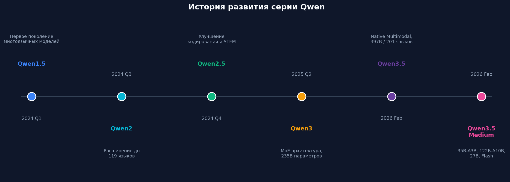
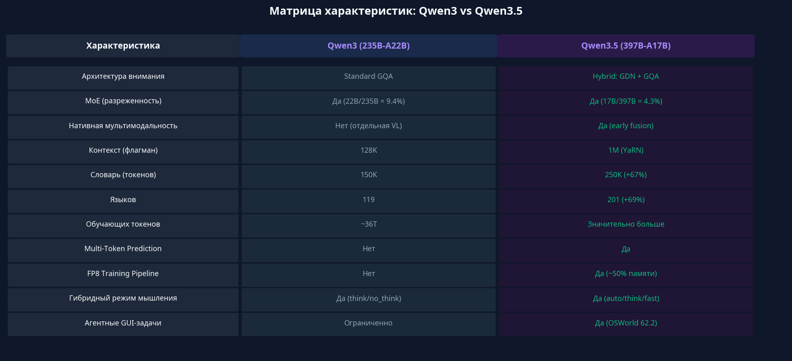
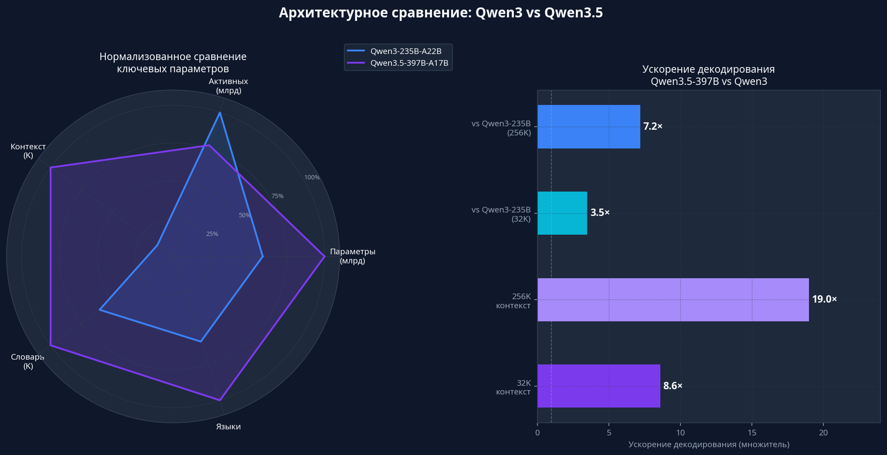
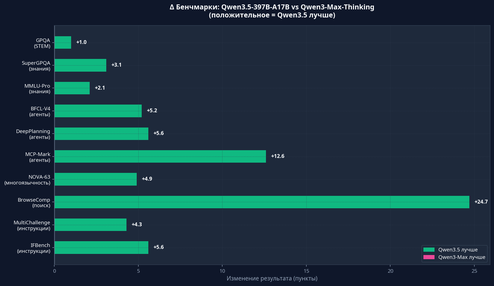
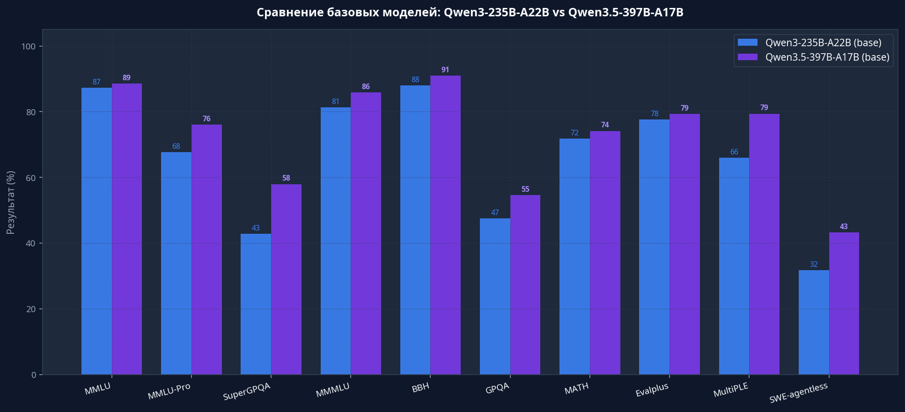
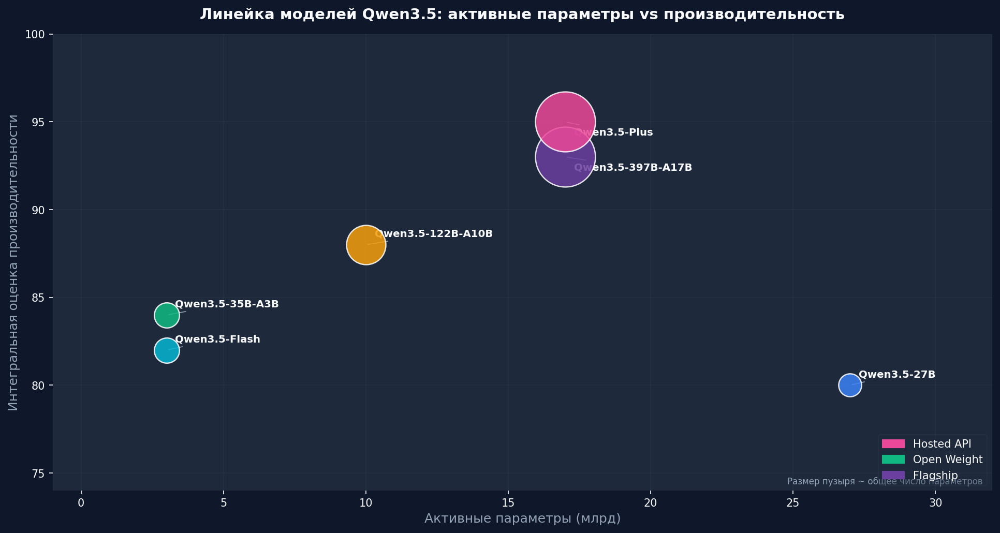
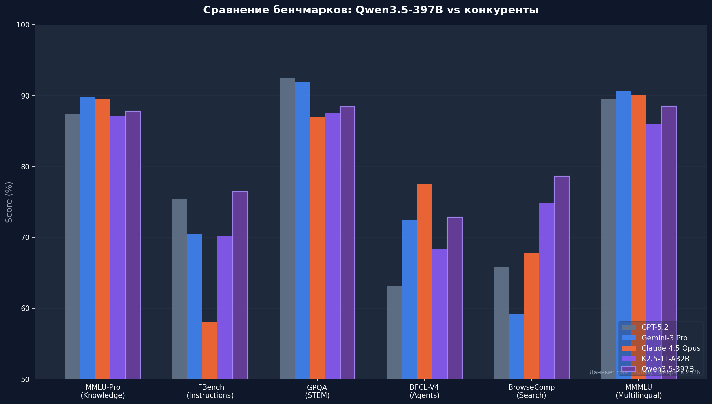
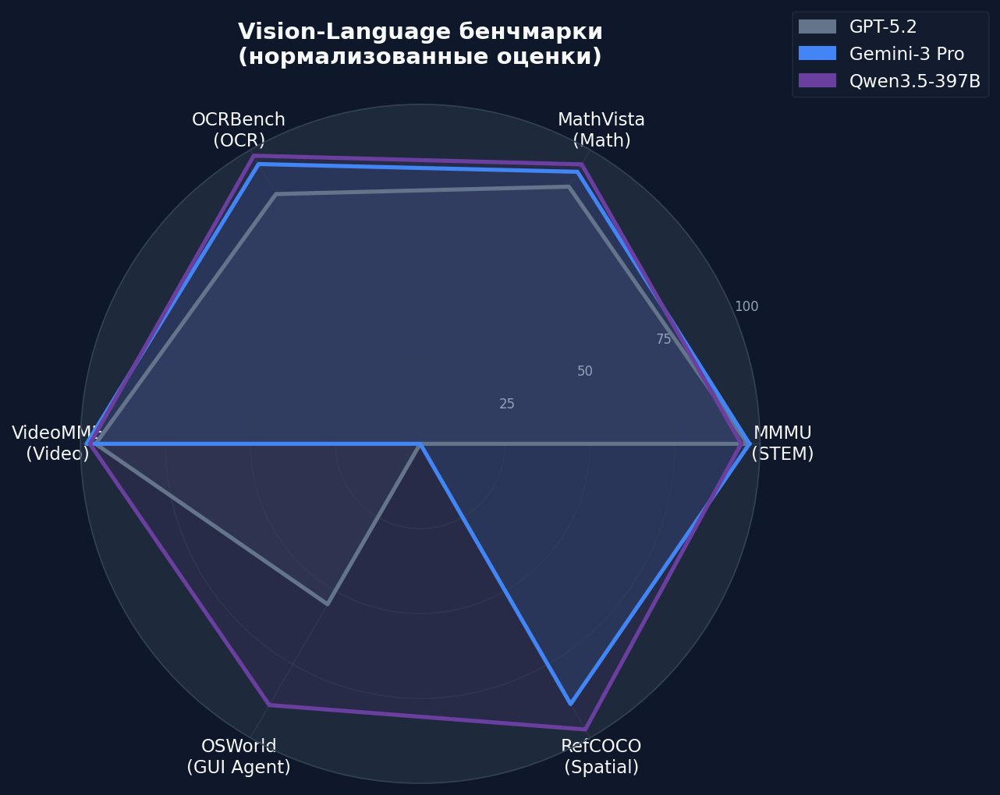
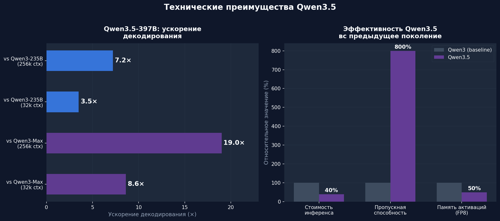

import Callout from '../../components/article/Callout.astro';
import QuantCard from '../../components/article/QuantCard.astro';
import MemoryBar from '../../components/article/MemoryBar.astro';
import MoeExplorer from '../../components/article/MoeExplorer';
import ModelComparison from '../../components/article/ModelComparison';

## Ну чё, малютки, Alibaba снова жжёт 🔥

15 февраля 2026 года Alibaba выкатила **Qwen3.5-397B-A17B** — флагман новой серии. А 24 февраля подъехали «средние» модели: `Qwen3.5-35B-A3B`, `Qwen3.5-122B-A10B` и `Qwen3.5-27B`. И знаете что? Это не очередной апдейт с +2% на бенчмарках. Это полноценный сдвиг парадигмы.

Пока все гоняются за триллионами параметров, китайцы сделали ставку на **архитектурную элегантность**, качественные данные и вычислительную эффективность. И, если честно, это сработало.

<Callout type="fire" title="Вот это поворот">
Qwen3.5-35B-A3B с **3 лярдами активных параметров** рвёт Qwen3-235B-A22B с 22 лярдами активных. _Три лярда бьют двадцать два._ Умная архитектура + качественные данные > грубая сила масштаба.
</Callout>

<QuantCard title="397B" badge="Параметров" badgeColor="#7c3aed">
Общее число параметров флагмана — но только **17B** активируются при каждом проходе. Остальные сидят и ждут своей очереди. MoE, малютки.
</QuantCard>

<QuantCard title="201 язык" badge="Мультиязычность" badgeColor="#3b82f6">
С 119 до 201 языка и диалекта. Самый широкий охват среди открытых моделей. Даже ваш диалект, наверное, поддерживается.
</QuantCard>

<QuantCard title="19× быстрее" badge="Ускорение" badgeColor="#10b981">
В 19 раз быстрее Qwen3-Max на длинных контекстах (256k токенов). Не опечатка — девятнадцать.
</QuantCard>

<QuantCard title="1M токенов" badge="Контекст" badgeColor="#f59e0b">
Миллион токенов контекста — это ~2 часа видео или целая кодовая база. Закидываешь весь проект и спрашиваешь «что не так».
</QuantCard>

---

## Как Qwen дошёл до жизни такой

Серия Qwen прошла дикий путь за два года. Каждое поколение — не просто +5% на бенчмарках, а принципиально новые возможности. От «ну, норм модель» до «стоп, это реально конкурент GPT?».

С Qwen3.5 Alibaba поставила на три лошади: **мощность** (больше визуально-текстовых токенов при обучении), **эффективность** (гибридный MoE с дикой разреженностью) и **универсальность** (нативная мультимодальность + 201 язык). И все три пришли первыми.

---

## Qwen3.5 vs Qwen3: Апдейт или новая эра?

Малютки, давайте разберёмся — это просто +0.5 к версии или реально новый уровень? Спойлер: это не апдейт. Это другая модель.

### Матрица характеристик

Вот вам наглядно — флагманы лоб в лоб: Qwen3-235B-A22B против Qwen3.5-397B-A17B.

### Что поменялось под капотом

Qwen3.5 притащил гибридное внимание — **Gated Delta Networks (GDN)** + **Gated Attention (GA)** вместо стандартного GQA у Qwen3. Плюс разреженность MoE выросла с 9.4% до 4.3% — модель активирует ещё меньше параметров на каждый токен, но при этом работает лучше. Магия? Нет, инженерия.

<QuantCard title="Qwen3" badge="Старичок" badgeColor="#64748b">
**235B** параметров, **22B** активных. Стандартный GQA. Разреженность MoE: **9.4%**. 119 языков. Был хорош, но время пришло.
</QuantCard>

<QuantCard title="Qwen3.5" badge="Новый король" badgeColor="#7c3aed">
**397B** параметров, **17B** активных. Гибридный GDN+GA. Разреженность MoE: **4.3%**. 201 язык. До **19×** быстрее. Другая лига.
</QuantCard>

### Бенчмарки: цифры не врут

Qwen3.5-397B-A17B стабильно рвёт Qwen3-Max-Thinking по всем фронтам — инструкции, агентные задачи, мультиязычность.

### Базовые модели: прогресс на фундаментальном уровне

Даже без инструктивного тюнинга — base-модель Qwen3.5-397B-A17B показывает серьёзный отрыв в знаниях (MMLU-Pro, SuperGPQA) и кодировании (SWE-agentless).

<Callout type="tip" title="Моё мнение">
Это не эволюция, малютки. Это революция. Новая архитектура, нативное зрение, дикая эффективность — Qwen3.5 задаёт новый стандарт для открытых моделей. Точка.
</Callout>

---

## Архитектура: Что у этого зверя внутри 🔬

Окей, малютки, теперь самое вкусное — что под капотом. Сердце Qwen3.5 — гибридная архитектура **Qwen3-Next**, которая собрала в себе все актуальные инженерные решения.

<MoeExplorer client:visible />

<QuantCard title="⚡ Sparse MoE" badge="Архитектура" badgeColor="#7c3aed">
397 лярдов параметров, но только 17B работают на каждый токен. Остальные — резерв. Router решает, кого будить. Эффективность — космос.
</QuantCard>

<QuantCard title="🔬 Gated Delta Networks" badge="Внимание" badgeColor="#3b82f6">
Линейное внимание GDN + стандартные Gated Attention блоки. Соотношение 3:1 — три линейных слоя на один полный. Быстро и точно.
</QuantCard>

<QuantCard title="📷 Нативное зрение" badge="Мультимодальность" badgeColor="#10b981">
Early fusion — текст и картинки сливаются ещё при предобучении. Модель «видит» с рождения, а не учится видеть через костыли постфактум.
</QuantCard>

<QuantCard title="📄 Multi-Token Prediction" badge="Генерация" badgeColor="#f59e0b">
Предсказывает несколько токенов за раз. Генерация быстрее, длинные тексты согласованнее. Простая идея — мощный эффект.
</QuantCard>

<QuantCard title="🛠️ FP8 Training" badge="Обучение" badgeColor="#ec4899">
Нативный FP8 пайплайн. Память −50%, скорость +10%. Тренировать такого монстра стало реально дешевле.
</QuantCard>

<QuantCard title="🌐 250K словарь" badge="Токенизация" badgeColor="#06b6d4">
250K токенов вместо 150K у Qwen3. Эффективность кодирования выросла на 10–60% для большинства языков. Меньше токенов = дешевле инференс.
</QuantCard>

### Спеки Qwen3.5-27B (для тех, кто любит цифры)

| Параметр | Значение |
| :--- | :--- |
| Число параметров | 27 млрд |
| Скрытая размерность | 5120 |
| Число слоёв | 64 |
| Структура слоёв | 16 × (3 × Gated DeltaNet → 1 × Gated Attention) |
| Словарь (токенов) | 248 320 |
| Нативный контекст | 262 144 токена |
| Расширенный контекст (YaRN) | 1 010 000 токенов |
| Поддерживаемые языки | 201 |

---

## Семейство моделей: на любой кошелёк и задачу

Alibaba не ограничилась одним флагманом — выкатили целую линейку, от лёгких API-шных моделей для продакшена до тяжёлых монстров для исследований.

| Модель | Всего | Активных | Тип | Ключевые особенности |
| :--- | :--- | :--- | :--- | :--- |
| **Qwen3.5-397B-A17B** | 397B | 17B | Флагман | Максимум мощности, нативное зрение, 201 язык |
| **Qwen3.5-Plus** | ~397B | ~17B | Hosted API | 1M контекст, встроенный поиск и Code Interpreter |
| **Qwen3.5-122B-A10B** | 122B | 10B | Open-Weight | Для серьёзных агентных задач |
| **Qwen3.5-35B-A3B** | 35B | 3B | Open-Weight | Рвёт Qwen3-235B-A22B при 3B активных. Годнота |
| **Qwen3.5-27B** | 27B | 27B | Open-Weight | Dense-модель, 1M контекст, 201 язык |
| **Qwen3.5-Flash** | 35B | 3B | Hosted API | Для продакшена: минимальная задержка |

_«Qwen3.5-35B-A3B с 3B активными параметрами превосходит Qwen3-235B-A22B с 22B активными. MoE + качественные данные + RL = интеллект уровня фронтира при доле вычислительных затрат.»_ — MarkTechPost, 24 февраля 2026

---

## Бенчмарки: Как Qwen3.5 рвёт GPT-5.2 и Claude 4.5 🤯

А теперь самое интересное, малютки. Qwen3.5 не просто «конкурирует» — он реально бьёт GPT-5.2, Gemini 3 Pro и Claude 4.5 Opus на ряде задач.

<ModelComparison client:visible />

### Цифры, малютки, цифры

| Бенчмарк | GPT-5.2 | Gemini-3 Pro | Claude 4.5 Opus | K2.5-1T | Qwen3.5-397B |
| :--- | :--- | :--- | :--- | :--- | :--- |
| MMLU-Pro (знания) | 87.4 | **89.8** | 89.5 | 87.1 | 87.8 |
| IFBench (инструкции) | 75.4 | 70.4 | 58.0 | 70.2 | **76.5** |
| GPQA (STEM) | **92.4** | 91.9 | 87.0 | 87.6 | 88.4 |
| BFCL-V4 (агенты) | 63.1 | 72.5 | **77.5** | 68.3 | 72.9 |
| BrowseComp (поиск) | 65.8 | 59.2 | 67.8 | 74.9 | **78.6** |
| NOVA-63 (многоязычность) | 54.6 | 56.7 | 56.7 | 56.0 | **59.1** |
| TAU2-Bench (агенты) | 87.1 | 85.4 | **91.6** | 77.0 | 86.7 |
| SWE-bench Verified (код) | 80.0 | 76.2 | **80.9** | 76.8 | 76.4 |

<Callout type="info" title="Где Qwen3.5 топ-1">
**Следование инструкциям** (IFBench: 76.5), **веб-поиск** (BrowseComp: 78.6) и **мультиязычность** (NOVA-63: 59.1) — именно то, что нужно для агентных сценариев. Если строишь агентов — присмотрись.
</Callout>

---

## Зрение, видео и пространственный интеллект 📷

Малютки, Qwen3.5 — это не «языковая модель с прикрученным зрением». Это нативно мультимодальная система — она видит с рождения.

### Топовые результаты на vision-бенчмарках

<QuantCard title="93.1 — OCRBench" badge="Топ-1" badgeColor="#10b981">
Лучший OCR среди всех моделей. Читает текст с картинок лучше, чем ты после третьей чашки кофе.
</QuantCard>

<QuantCard title="92.3 — RefCOCO avg" badge="Топ-1" badgeColor="#10b981">
Точно указывает на объекты в изображениях. Ключевая штука для робототехники и GUI-автоматизации.
</QuantCard>

<QuantCard title="90.3 — MathVista" badge="Топ-1" badgeColor="#10b981">
Решает математику по графикам, диаграммам и формулам. Показываешь картинку — получаешь ответ.
</QuantCard>

<QuantCard title="62.2 — OSWorld" badge="GUI Agent" badgeColor="#7c3aed">
Автономно управляет десктопными приложениями через визуальный интерфейс. _Скайнет, ты?_
</QuantCard>

Отдельно кайфую от **пространственного интеллекта**: подсчёт объектов (CountBench: 97.2), пространственные отношения (EmbSpatialBench: 84.5) и точное указание на объекты (RefCOCO avg: 92.3). Это уже не «модель видит картинку» — это «модель понимает пространство».

---

## Скорость, стоимость и доступность: Главные козыри ⚡

Ладно, малютки, бенчмарки — это круто, но что по скорости и цене? А тут Qwen3.5 вообще рвёт всех.

<QuantCard title="8.6×" badge="Ускорение (32k)" badgeColor="#10b981">
В 8.6 раз быстрее Qwen3-Max на контексте 32k. Не проценты — разы.
</QuantCard>

<QuantCard title="19×" badge="Ускорение (256k)" badgeColor="#10b981">
На длинных контекстах (256k) — в 19 раз быстрее. Чем длиннее контекст, тем больше выигрыш. Красота.
</QuantCard>

<QuantCard title="−60%" badge="Стоимость" badgeColor="#3b82f6">
Инференс дешевле на 60% по сравнению с предыдущим поколением. Кошелёк скажет спасибо.
</QuantCard>

<QuantCard title="−50%" badge="Память" badgeColor="#f59e0b">
Потребление памяти активаций упало вдвое благодаря FP8 пайплайну. Больше моделей на одну тачку.
</QuantCard>

### Сколько VRAM нужно? (INT4 квантизация)

<MemoryBar label="Qwen3.5-27B (INT4)" value={16} max={80} color="#10b981" unit="ГБ" />
<MemoryBar label="Qwen3.5-35B-A3B (INT4)" value={20} max={80} color="#3b82f6" unit="ГБ" />
<MemoryBar label="Qwen3.5-122B-A10B (INT4)" value={65} max={80} color="#f59e0b" unit="ГБ" />
<MemoryBar label="Qwen3.5-397B-A17B (FP8)" value={397} max={400} color="#7c3aed" unit="ГБ" />

<Callout type="tip" title="Вдумайтесь, малютки">
Qwen3.5-35B-A3B с контекстом в **1 миллион токенов** работает на потребительской GPU с 32 ГБ VRAM. Модель уровня фронтира — на вашей RTX 4090. Без облака, без подписок, без лярдов на инфру.
</Callout>

---

## Где это применять: Агенты, код, автоматизация 🛠️

Qwen3.5 — это модель для эпохи агентного ИИ. Архитектура заточена под сценарии, где модель сама планирует и выполняет сложные многошаговые задачи. Вот что я вижу как основные юзкейсы:

<QuantCard title="💻 Vibe Coding" badge="Код" badgeColor="#7c3aed">
Интеграция с Qwen Code, Claude Code и другими тулами. Пишет, тестирует, итерирует код по твоим инструкциям. Vibe coding на максималках.
</QuantCard>

<QuantCard title="🔍 Агентный поиск" badge="Поиск" badgeColor="#3b82f6">
BrowseComp: 78.6, WideSearch: 74.0 — лучший результат. Модель сама лезет в интернет, собирает инфу и синтезирует ответ. Deep research из коробки.
</QuantCard>

<QuantCard title="📱 GUI-автоматизация" badge="Автоматизация" badgeColor="#10b981">
Управляет смартфонами и компами: заполняет таблицы, кликает по кнопкам, автоматизирует рутину. Твой личный RPA-бот.
</QuantCard>

<QuantCard title="📖 Анализ документов" badge="Документы" badgeColor="#f59e0b">
1M токенов контекста = целая кодовая база или многотомный документ. Без RAG, без костылей — просто закидываешь всё в контекст.
</QuantCard>

<QuantCard title="🎥 Понимание видео" badge="Видео" badgeColor="#ec4899">
До 2 часов видео: саммари, реверс-инжиниринг игровой логики, UI-наброски → код. Показал видео — получил результат.
</QuantCard>

<QuantCard title="🚗 Автономное вождение" badge="Робототехника" badgeColor="#06b6d4">
Пространственный интеллект + понимание видеопоследовательностей. Для тех, кто строит что-то на колёсах.
</QuantCard>

---

## Итого, малютки 🫡

Qwen3.5 — это ответ Alibaba на гигантоманию в мире LLM. Пока все наращивают триллионы параметров, китайцы доказали: умная архитектура + качественные данные > грубая сила. И сделали это с открытыми весами.

Что дальше? Согласно официальному блогу Qwen — переход от масштабирования модели к **системной интеграции**: агенты с персистентной памятью, механизмы самосовершенствования и экономическая осведомлённость. Цель — не просто инструменты, а _постоянные партнёры_, способные автономно работать над сложными многодневными проектами.

<Callout type="fire" title="Главный вывод">
Открытые модели вплотную подошли к проприетарным гигантам, а в ряде задач — **уже превзошли их**. Следование инструкциям, веб-поиск, мультиязычность — тут Qwen3.5 топ-1. Для нас, разработчиков и исследователей, это огонь. Гоняйте, тестируйте, стройте агентов. Будущее уже здесь.
</Callout>

---

**Источники:**
- [Qwen AI Official Blog — «Qwen3.5: Towards Native Multimodal Agents»](https://qwen.ai/blog?id=qwen3.5)
- [MarkTechPost — «Alibaba Qwen Team Releases Qwen 3.5 Medium Model Series»](https://www.marktechpost.com/2026/02/24/alibaba-qwen-team-releases-qwen-3-5-medium-model-series-a-production-powerhouse-proving-that-smaller-ai-models-are-smarter/)
- [Hugging Face — Qwen/Qwen3.5-27B Model Card](https://huggingface.co/Qwen/Qwen3.5-27B)
- [GitHub — QwenLM/Qwen3.5 Repository](https://github.com/QwenLM/Qwen3.5)
- [Artificial Analysis — «Qwen3.5-397B-A17B: Everything you need to know»](https://artificialanalysis.ai/articles/qwen3-5-397b-a17b-everything-you-need-to-know)
