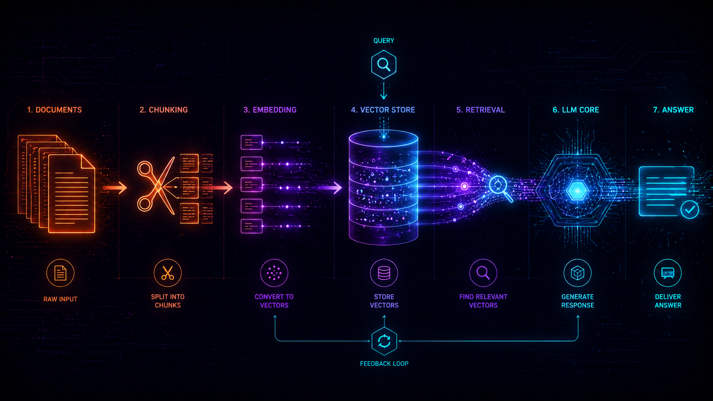
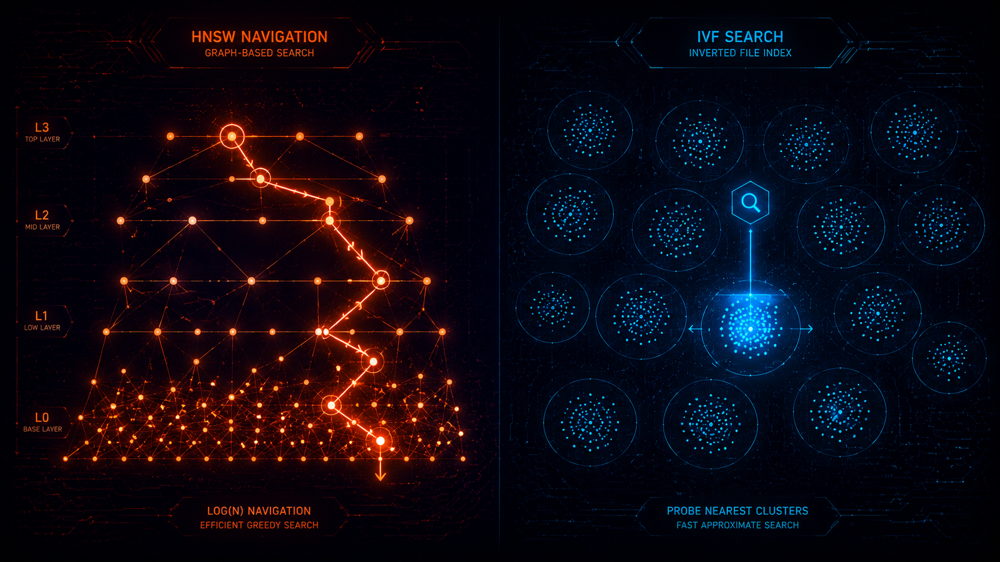

import Callout from '../../components/article/Callout.astro';
import QuantCard from '../../components/article/QuantCard.astro';
import StepList from '../../components/article/StepList.astro';
import ChunkingVisualizer from '../../components/article/ChunkingVisualizer';
import EmbeddingSpaceExplorer from '../../components/article/EmbeddingSpaceExplorer';
import RagPipelinePlayground from '../../components/article/RagPipelinePlayground';
import RagArchitectureExplorer from '../../components/article/RagArchitectureExplorer';
import QueryTransformationDemo from '../../components/article/QueryTransformationDemo';
import RagasDiagnostic from '../../components/article/RagasDiagnostic';

LLM знает то, что было в её обучающих данных, и ничего больше. Спроси про вчерашний релиз, про внутреннюю документацию компании или про содержимое конкретного PDF — и получишь либо честное «не знаю», либо, что хуже, уверенную галлюцинацию. RAG (Retrieval-Augmented Generation) чинит это не переобучением модели, а более простым трюком: перед тем как модель отвечает, ей подкладывают в промпт релевантные куски внешних данных, найденные под конкретный запрос.

Звучит как «просто прикрутить векторную БД». На практике каждый шаг этого пайплайна (чанкинг, поиск, ранжирование) имеет десяток вариантов реализации с разными компромиссами, и большинство «RAG не работает» на деле сводится к одному конкретному звену, а не ко всей идее сразу. Дальше разбираю по порядку: что происходит на каждом шаге, как эти шаги складываются в архитектуры, рабочий код и на чём всё это собрать без единого API-ключа.



## Зачем вообще RAG

<StepList steps={[
  { num: "1", text: "<strong>Устаревшие знания.</strong> Модель обучена на срезе данных до определённой даты — про вчерашние события и постоянно меняющуюся документацию она в принципе не может знать." },
  { num: "2", text: "<strong>Приватные данные.</strong> Внутренние базы знаний, переписка, код компании — этого не было и не могло быть в обучающей выборке." },
  { num: "3", text: "<strong>Галлюцинации.</strong> Без опоры на источник модель с одинаковой уверенностью выдаёт и правду, и выдумку. С RAG у неё есть на что сослаться — и что процитировать." },
  { num: "4", text: "<strong>Дообучение дороже.</strong> Зафайнтюнить модель под каждое обновление базы знаний долго и дорого. Обновить векторный индекс — вопрос минут." },
]} />

Ключевая мысль: RAG не делает модель умнее. Он даёт ей более релевантный контекст в моменте. Вся дальнейшая механика — про то, как найти этот контекст быстро и точно.

## Чанкинг

Документы режут на куски (чанки) перед индексацией по двум причинам. Во-первых, у эмбеддинг-моделей есть лимит на длину входа. Во-вторых, даже без лимита: эмбеддинг всего документа размывает смысл, если документ на пять тем, и вектор получится «средним» по всем пяти, не близким ни к одному специфичному запросу.

Три основных подхода:

- **Fixed-size** — режем по N символов (или токенов) с фиксированным перекрытием (overlap). Просто, предсказуемо, не заботится о смысловых границах: может разрезать предложение ровно пополам.
- **Recursive** — пытается резать по «естественным» границам: сначала по абзацам, потом (если абзац всё равно длиннее лимита) по предложениям, и только если совсем не влезает — по словам. Это то, что делает `RecursiveCharacterTextSplitter` в LangChain.
- **Semantic** — группирует соседние предложения по смысловой близости (в проде это косинусная близость их эмбеддингов), а не по фиксированной длине. Чанк заканчивается там, где начинается новая тема, а не там, где кончился лимит символов.

<ChunkingVisualizer client:visible />

Оверлап (fixed-size) существует не просто так: без него предложение на границе двух чанков может оказаться разорвано, и обе половины станут бесполезны для поиска — при индексации потеряна и та, и другая. С оверлапом кусок текста на границе попадёт целиком хотя бы в один из двух соседних чанков.

<Callout type="tip" title="Как выбрать размер чанка">
Универсального числа нет, но ориентир есть: чанк должен быть достаточно большим, чтобы содержать законченную мысль, и достаточно маленьким, чтобы не размывать эмбеддинг между темами. На практике для прозы это обычно 200–500 токенов с оверлапом 10–20% от размера чанка. Для кода и таблиц правила другие — там естественные границы (функция, строка таблицы) важнее фиксированной длины.
</Callout>

## Эмбеддинги

Эмбеддинг — это вектор чисел (обычно 300–1500 измерений). Модель переводит текст в это пространство так, чтобы близкий по смыслу текст оказывался рядом, а несвязанный — далеко. Дальше поиск сводится к геометрии: найти ближайшие к запросу точки.

Ниже — настоящие эмбеддинги 18 предложений (модель `BAAI/bge-small-en-v1.5`), сжатые из 384 измерений в 2D через PCA, чтобы их вообще можно было нарисовать.

<EmbeddingSpaceExplorer client:visible />

Обрати внимание на кластер «спорт»: он размытее остальных, и его точки не всегда друг другу ближайшие соседи. Это не баг компонента, это честная иллюстрация: 2D-проекция сохраняет только часть структуры полного 384-мерного пространства (PCA здесь объясняет около четверти дисперсии), а короткие обиходные фразы без специфичной лексики сложнее развести по смыслу, чем узкотематические — модели не за что зацепиться.

<div class="grid-2" style="margin: 1.5em 0;">
<QuantCard title="384–4096" badge="Размерность" badgeColor="#06b6d4">
Диапазон размерностей современных эмбеддинг-моделей: от компактных 384 (BGE-small) до 4096 у самых крупных. Больше измерений — точнее, но дороже хранить и медленнее сравнивать.
</QuantCard>

<QuantCard title="Cosine" badge="Метрика по умолчанию" badgeColor="#c946ff">
Косинусная близость — стандартная метрика для эмбеддингов текста: она сравнивает направление векторов, а не их длину, так что не важно, «увереннее» ли модель в одном эмбеддинге, чем в другом.
</QuantCard>
</div>

## Векторный поиск и индексация

Найти ближайший вектор перебором (посчитать расстояние до каждой точки) работает на тысячах документов и разваливается на миллионах: линейный перебор по миллиону 768-мерных векторов на каждый запрос никто себе не может позволить. Поэтому в проде используют приближённый поиск ближайших соседей (ANN, Approximate Nearest Neighbor) — жертвуют долей точности ради скорости на порядки.

Самый распространённый алгоритм — **HNSW** (Hierarchical Navigable Small World): граф, где каждая точка соединена с ближайшими соседями на нескольких уровнях, а поиск идёт сверху вниз: сначала грубо по редкому верхнему слою, потом всё точнее. Это то, что использует большинство современных векторных БД под капотом (Qdrant, Weaviate, Milvus). Альтернатива: IVF (Inverted File Index), где пространство разбивается на кластеры, а поиск сначала находит ближайшие кластеры и только потом ищет внутри них.



<Callout type="info" title="Векторная БД — это не обязательно отдельный сервис">
Для небольших проектов `pgvector` (расширение Postgres) часто разумнее, чем поднимать отдельный векторный сервис: одна база данных вместо двух, транзакции работают как обычно, не нужен отдельный слой синхронизации. Отдельная векторная БД (Qdrant, Weaviate, Milvus) начинает окупаться, когда счёт идёт на десятки миллионов векторов или нужны специфичные фичи — фильтрация по метаданным на лету, шардирование, hybrid search из коробки.
</Callout>

## Hybrid search: BM25 + векторы

Векторный поиск отлично находит семантически близкое, но проваливается на точных совпадениях. Спроси «код ошибки E1042»: вектор запроса может оказаться ближе к общим текстам про ошибки, чем к документу, где буквально написано «E1042», если модель не считает точное совпадение кода ошибки чем-то особенным. **BM25** — классический алгоритм ранжирования по совпадению ключевых слов (наследник TF-IDF, используется в Elasticsearch/Lucene), с этой проблемой не сталкивается: если слово есть в документе, оно его найдёт, независимо от того, «понимает» ли алгоритм смысл.

Хороший RAG использует оба сигнала одновременно — **hybrid search**. Проблема в том, что оценки BM25 (могут быть от 0 до десятков) и косинусная близость (от -1 до 1) находятся в разных шкалах, и напрямую их складывать бессмысленно. Стандартное решение — **Reciprocal Rank Fusion (RRF)**: вместо оценок берём только *позицию* документа в каждом из двух ранжированных списков и считаем `score = Σ 1/(k + rank)` по обоим спискам (k обычно равна 60). Работает без подбора весов и без нормализации шкал, поэтому и стало де-факто стандартом.

## Reranking

Даже после hybrid search и RRF топ-N документов — это ещё не финал. Векторный поиск (bi-encoder: запрос и документ кодируются в вектор *независимо* друг от друга) быстрый, потому что эмбеддинги документов считаются заранее, один раз. Но у независимого кодирования есть потолок точности: модель никогда не видела запрос и документ *вместе*.

**Cross-encoder** это исправляет: он получает пару (запрос, документ) целиком и выдаёт одну оценку релевантности именно этой пары. Точнее, но дороже — считать нужно на каждый запрос заново, для каждого документа-кандидата, поэтому cross-encoder не используют для поиска по всей базе, а применяют вторым проходом только к top-N кандидатам, найденным быстрым bi-encoder/BM25-поиском.

Вот всё вместе, от запроса до финального порядка документов, на реальных данных:

<RagPipelinePlayground client:visible />

Смотри на второй запрос: у cross-encoder документ про cross-encoder (да, буквально) после reranking падает с 2-го места на 5-е — модель, взглянув на пару «запрос + документ» вместе, а не по отдельности, поняла, что документ про сам reranking релевантен слабее, чем казалось по чистой векторной близости. Это ровно та ошибка bi-encoder, которую reranking и должен ловить.

## Query transformation

Иногда проблема не в поиске, а в самом запросе. Пользователь пишет «а как там с ценами» — без контекста непонятно, что искать. Несколько техник это лечат:

- **Query rewriting** — модель переформулирует запрос в более развёрнутый и однозначный перед поиском.
- **HyDE (Hypothetical Document Embeddings)** — вместо поиска по эмбеддингу самого запроса модель сначала генерирует гипотетический ответ на него, а ищет уже по эмбеддингу этого гипотетического документа. Звучит странно, но работает: гипотетический ответ по структуре ближе к реальным документам в базе, чем короткий вопрос.
- **Multi-query** — генерируется несколько перефразировок одного запроса, поиск идёт по каждой, результаты объединяются (та же RRF-логика).
- **Декомпозиция** — сложный составной вопрос («сравни X и Y по Z») разбивается на подвопросы, каждый ищется отдельно.

<QueryTransformationDemo client:visible />

## Как понять, что RAG работает

Самая частая ошибка — оценивать RAG на глаз: «ответы выглядят разумно». Есть конкретные метрики, которые точно показывают, где именно всё сломалось, в поиске или в генерации:

| Метрика | Что проверяет | Ловит какую поломку |
|---|---|---|
| **Context Precision** | Много ли шума среди найденных документов | Плохой поиск / реранкинг |
| **Context Recall** | Нашёлся ли вообще весь нужный контекст | Плохой поиск, слишком маленький top-k |
| **Faithfulness** | Опирается ли ответ на найденный контекст, а не выдуман | Модель галлюцинирует поверх правильного контекста |
| **Answer Relevancy** | Отвечает ли ответ на заданный вопрос | Модель ушла не туда даже с хорошим контекстом |

Фреймворк **RAGAS** (Retrieval Augmented Generation Assessment) считает эти метрики автоматически, используя LLM как судью — не нужно вручную размечать «правильные» ответы для каждого теста:

```python
from ragas import evaluate
from ragas.metrics import faithfulness, answer_relevancy, context_precision, context_recall
from datasets import Dataset

data = Dataset.from_dict({
    "question": ["Как работает RRF?"],
    "answer": ["RRF объединяет позиции документов из разных ранжированных списков по формуле 1/(k+rank)."],
    "contexts": [["Reciprocal Rank Fusion combines multiple ranked lists into a single ranking without tuning weights."]],
    "ground_truth": ["RRF — метод слияния ранжированных списков без ручной настройки весов."],
})

result = evaluate(data, metrics=[faithfulness, answer_relevancy, context_precision, context_recall])
print(result)
```

Низкий `context_recall` при высоком `faithfulness` значит: модель честно отвечает по тому, что нашла, но нашла не всё. Чини поиск, не промпт. Обратная ситуация (высокий recall, низкий faithfulness) значит обратное: контекст на месте, модель его игнорирует и выдумывает — чини промпт или саму генерацию.

<RagasDiagnostic client:visible />

## Архитектуры RAG

Всё описанное выше — механики, а архитектура — это то, как их складывают вместе. Ниже: 12 подходов, сгруппированных по тому, какую именно проблему базового RAG они решают. Часть представляет собой прямую эволюцию naive-варианта, часть меняет саму структуру поиска, часть учит систему понимать, когда и как именно нужно искать, часть занимается только эффективностью, а один подход к retrieval вообще не относится, хотя его часто путают с RAG.

<RagArchitectureExplorer client:visible />

### Основной путь: naive → advanced → modular → agentic

Это прямая линия усложнения, которую проходит почти любой RAG-проект по мере роста. Naive — просто нашёл и подставил. Advanced добавляет обработку запроса до поиска и очистку результатов после. Modular разбивает retrieval на взаимозаменяемые модули под разные источники данных. Agentic отдаёт агенту решение, когда и сколько раз вызывать retrieval как tool.

<div class="grid-2" style="margin: 1.5em 0;">
<QuantCard title="1 проход" badge="Naive" badgeColor="#64748b">
Нашёл — подставил. Ни обработки запроса, ни проверки результата.
</QuantCard>

<QuantCard title="+2 шага" badge="Advanced" badgeColor="#3b82f6">
Rewriting/HyDE до поиска, reranking после — тот же поиск, но чище на входе и выходе.
</QuantCard>

<QuantCard title="N модулей" badge="Modular" badgeColor="#10b981">
Retrieval — взаимозаменяемые источники под роутером, а не один монолитный блок.
</QuantCard>

<QuantCard title="Сам решает" badge="Agentic" badgeColor="#c946ff">
Агент вызывает retrieval как обычный tool, столько раз, сколько сочтёт нужным.
</QuantCard>
</div>

### Другая структура поиска: GraphRAG и RAPTOR

Обе архитектуры не режут корпус на независимые чанки, а строят над ним дополнительную структуру ещё до запросов.

**GraphRAG** (метод, который продвигает Microsoft Research) превращает документы в граф сущностей и связей. Вопрос вида «как компания X связана с судебным делом Y через директора Z» — это не про похожесть текста, это про путь в графе. Обычный similarity search такое в принципе не находит, сколько чанков ни читай по отдельности.


**RAPTOR** решает другую задачу: чанки кластеризуются и рекурсивно суммаризируются вверх, получается дерево. Поиск может забрать как конкретный лист (точный факт), так и обобщающее саммари уровня выше (общая картина по разделу или всему корпусу) — то, что обычный чанк-поиск в принципе не умеет отдать.


### Знает, когда и как искать: Self-RAG/CRAG, FLARE, Adaptive-RAG

Три разных ответа на вопрос «когда retrieval вообще нужен и как понять, что он не удался».

**Self-RAG / CRAG** ретривит один раз, но критикует найденное перед тем, как генерировать ответ, и уходит в fallback-поиск, если то, что нашлось, не годится. **FLARE** идёт дальше: следит за уверенностью модели прямо по ходу генерации ответа и включает дополнительный retrieval на лету, как только уверенность проседает, не дожидаясь конца ответа. **Adaptive-RAG** решает вопрос ещё до генерации: классификатор сложности запроса сразу направляет его в подходящий по весу пайплайн — простой факт вообще без поиска, сложный вопрос в многошаговый retrieval. Это то, что чаще всего называют лучшей практикой для прода: не тратить полный agentic-пайплайн на вопрос, который решается одним фактом.

<div class="grid-2" style="margin: 1.5em 0;">
<QuantCard title="Проверяет себя" badge="Self-RAG / CRAG" badgeColor="#f59e0b">
Критикует найденное перед генерацией — плохой контекст не идёт в промпт молча.
</QuantCard>

<QuantCard title="На лету" badge="FLARE" badgeColor="#ef4444">
Retrieval внутри генерации, а не до неё — по сигналу упавшей уверенности модели.
</QuantCard>

<QuantCard title="3 уровня" badge="Adaptive-RAG" badgeColor="#06b6d4">
Классификатор сложности сам выбирает: без поиска, один проход или многошагово.
</QuantCard>
</div>

### Эффективность: Speculative RAG и REPLUG

**Speculative RAG** переносит в RAG идею спекулятивного декодинга: быстрая модель параллельно генерирует несколько черновых ответов по разным подмножествам найденных документов, а модель-верификатор выбирает лучший — вместо честной, но медленной генерации с нуля. **REPLUG** работает с LLM как с чёрным ящиком и вообще её не трогает: обучается только отдельный ретривер, на сигнале о том, какие документы реально помогли модели ответить точнее.

<div class="grid-2" style="margin: 1.5em 0;">
<QuantCard title="Параллельно" badge="Speculative RAG" badgeColor="#ff6b2b">
Несколько черновиков разом от быстрой модели, а не один медленный проход от крупной.
</QuantCard>

<QuantCard title="0 finetuning LLM" badge="REPLUG" badgeColor="#8b5cf6">
Дообучается только ретривер. Сама генеративная модель остаётся неизменной.
</QuantCard>
</div>

### Без retrieval вообще: CAG

**Cache-Augmented Generation** формально не архитектура RAG — retrieval в ней нет вообще. Весь корпус (если влезает) грузится в контекстное окно модели заранее, а его KV-cache сохраняется и переиспользуется на каждый запрос без нового поиска. Быстрее и проще RAG, пока база знаний небольшая, стабильная и умещается в контекст. Как только корпус растёт быстрее контекстного окна или обновляется чаще, чем можно перегенерировать кеш, CAG перестаёт работать, а RAG — нет.

| Архитектура | Решает | Цена |
|---|---|---|
| Naive | Базовый кейс: нашёл, подставил | Простейшая, ограниченная точность |
| Advanced | Плохие запросы, шум в результатах | +latency на rewriting и reranking |
| Modular | Разные типы источников данных одновременно | Сложность роутинга между модулями |
| Agentic | Запросы, требующие нескольких шагов поиска | Непредсказуемая latency, дороже по токенам |
| GraphRAG | Вопросы про связи между сущностями | Дорогой оффлайн-этап построения графа |
| RAPTOR | Нужен то факт, то общая картина по корпусу | Дорогой оффлайн-этап кластеризации |
| Self-RAG / CRAG | Retrieval, который иногда ничего не находит | Нужна модель, способная к self-reflection |
| FLARE | Ответ, который проседает по ходу генерации | Retrieval может сработать несколько раз за один ответ |
| Adaptive-RAG | Лишние затраты на простые запросы | Нужен отдельный классификатор сложности |
| Speculative RAG | Задержка полного цикла retrieval + генерация | Две модели вместо одной, больше токенов |
| REPLUG | Нельзя дообучать саму LLM | Нужен отдельный контур обучения ретривера |
| CAG | Latency и сложность retrieval как таковая | Весь корпус должен влезать в контекст |

Источники: [обзорная статья по RAG](https://arxiv.org/pdf/2312.10997) и [репозиторий CAG](https://github.com/hhhuang/CAG) с описанием подхода как альтернативы, а не варианта RAG.

## Полный рабочий пример

Одна и та же логика (чанкинг → эмбеддинги → индекс → hybrid retrieval → rerank → генерация) реализована сначала «с нуля» на лёгком стеке без единого API-ключа, потом то же самое — через фреймворк, чтобы было видно, что именно он берёт на себя.

### С нуля: sentence-transformers + ChromaDB + rank_bm25

```python
from sentence_transformers import SentenceTransformer, CrossEncoder
from rank_bm25 import BM25Okapi
import chromadb

embedder = SentenceTransformer("BAAI/bge-small-en-v1.5")
reranker = CrossEncoder("cross-encoder/ms-marco-MiniLM-L-6-v2")

docs = [
    "Vector databases store high-dimensional embeddings for fast similarity search.",
    "BM25 ranks documents by keyword overlap, no neural network involved.",
    "Reranking with a cross-encoder improves precision at the cost of latency.",
    # ... остальные документы корпуса
]

# 1. Индексация: эмбеддинги в Chroma, токены в BM25
client = chromadb.PersistentClient(path="./chroma_db")
collection = client.get_or_create_collection("docs")
collection.add(
    documents=docs,
    embeddings=embedder.encode(docs).tolist(),
    ids=[str(i) for i in range(len(docs))],
)
bm25 = BM25Okapi([d.lower().split() for d in docs])

def hybrid_search(query, top_k=6, k_rrf=60):
    # 2. Vector search
    q_emb = embedder.encode([query]).tolist()
    vec_result = collection.query(query_embeddings=q_emb, n_results=len(docs))
    vec_rank = [int(i) for i in vec_result["ids"][0]]

    # 3. BM25
    bm25_scores = bm25.get_scores(query.lower().split())
    bm25_rank = sorted(range(len(docs)), key=lambda i: -bm25_scores[i])

    # 4. Reciprocal Rank Fusion
    scores = {}
    for rank_list in (vec_rank, bm25_rank):
        for pos, idx in enumerate(rank_list):
            scores[idx] = scores.get(idx, 0) + 1 / (k_rrf + pos + 1)
    fused = sorted(scores, key=lambda i: -scores[i])[:top_k]

    # 5. Rerank топ кандидатов cross-encoder'ом
    pairs = [(query, docs[i]) for i in fused]
    rerank_scores = reranker.predict(pairs)
    reranked = [doc for _, doc in sorted(zip(rerank_scores, [docs[i] for i in fused]), reverse=True)]
    return reranked

context = hybrid_search("How does RRF combine ranked lists?")
# 6. Генерация: контекст в промпт
prompt = f"Context:\n{chr(10).join(context[:3])}\n\nQuestion: ...\nAnswer:"
```

### То же самое через LangChain + Qdrant

```python
from langchain_community.vectorstores import Qdrant
from langchain_community.embeddings import HuggingFaceEmbeddings
from langchain.retrievers import EnsembleRetriever
from langchain_community.retrievers import BM25Retriever
from langchain.text_splitter import RecursiveCharacterTextSplitter

splitter = RecursiveCharacterTextSplitter(chunk_size=300, chunk_overlap=50)
chunks = splitter.split_documents(raw_documents)

embeddings = HuggingFaceEmbeddings(model_name="BAAI/bge-small-en-v1.5")
vectorstore = Qdrant.from_documents(chunks, embeddings, url="http://localhost:6333", collection_name="docs")

vector_retriever = vectorstore.as_retriever(search_kwargs={"k": 6})
bm25_retriever = BM25Retriever.from_documents(chunks)
bm25_retriever.k = 6

# EnsembleRetriever сам делает то, что мы выше писали руками — RRF по двум ретриверам
hybrid_retriever = EnsembleRetriever(retrievers=[vector_retriever, bm25_retriever], weights=[0.5, 0.5])
results = hybrid_retriever.invoke("How does RRF combine ranked lists?")
```

Разница нагляднее самого кода: `EnsembleRetriever` — это ровно тот же RRF-цикл, что мы писали руками выше, просто спрятанный за одним классом. Фреймворк не делает ничего принципиально другого: берёт на себя бойлерплейт и даёт единый интерфейс поверх десятков векторных БД и ретриверов, чтобы не переписывать интеграционный код при смене одного компонента на другой.

## Опенсорс-экосистема

Курированный список, с чего начать — не исчерпывающий каталог всего, что есть на рынке.

**Оркестраторы**

| Инструмент | Для чего |
|---|---|
| [LangChain](https://github.com/langchain-ai/langchain) | Самая широкая экосистема интеграций, но и самая тяжёлая абстракция |
| [LlamaIndex](https://github.com/run-llama/llama_index) | Более сфокусирован на retrieval/индексации, чем LangChain |
| [Haystack](https://github.com/deepset-ai/haystack) | Пайплайны как явные графы шагов — проще дебажить, чем скрытые цепочки |

**Векторные БД**

| Инструмент | Для чего |
|---|---|
| [Chroma](https://github.com/chroma-core/chroma) | Проще всего поднять локально, для прототипов и небольших проектов |
| [Qdrant](https://github.com/qdrant/qdrant) | Написан на Rust, быстрый, с фильтрацией по метаданным из коробки |
| [Weaviate](https://github.com/weaviate/weaviate) | Встроенный hybrid search и модули для мультимодальных данных |
| [Milvus](https://github.com/milvus-io/milvus) | Рассчитан на миллиарды векторов, шардирование из коробки |
| `pgvector` | Расширение Postgres — векторный поиск без отдельного сервиса |

**Эмбеддинги и reranking**

| Инструмент | Для чего |
|---|---|
| [BGE (BAAI)](https://github.com/FlagOpen/FlagEmbedding) | Семейство от small до large, хорошее качество/цена, есть мультиязычные |
| [E5 (intfloat)](https://huggingface.co/intfloat) | Конкурент BGE, тоже с мультиязычными вариантами |
| `cross-encoder/ms-marco-*` | Стандартные лёгкие реранкеры, обучены на MS MARCO |
| [Jina Reranker](https://huggingface.co/jinaai) | Мультиязычные варианты реранкеров |

**Оценка**

| Инструмент | Для чего |
|---|---|
| [RAGAS](https://github.com/explodinggradients/ragas) | LLM-as-judge метрики: faithfulness, precision, recall |
| [TruLens](https://github.com/truera/trulens) | Похожий набор метрик + удобная визуализация трейсов |

## TL;DR

RAG — это конвейер, а не один компонент, и «не работает» почти всегда значит «сломалось одно конкретное звено». Чанкинг режет документы, стараясь не рвать смысл посередине. Эмбеддинги превращают текст в вектор, где близость по смыслу — это близость в пространстве. Векторный поиск (через HNSW или похожий ANN-алгоритм) находит кандидатов быстро, но проваливается на точных совпадениях: для этого рядом держат BM25 и сливают оба сигнала через Reciprocal Rank Fusion. Cross-encoder reranking вторым проходом уточняет порядок топ-кандидатов, которые bi-encoder оценивал по отдельности. RAGAS и подобные метрики точно показывают, ломается ли поиск или генерация, а не заставляют гадать «на глаз». Архитектур на практике много — от прямой линии naive → advanced → modular → agentic до GraphRAG и RAPTOR (другая структура поиска), Self-RAG/FLARE/Adaptive-RAG (знают, когда искать) и CAG, которая retrieval вообще не делает — но все они отвечают на один и тот же вопрос: что делать, когда простого retrieve-then-generate уже не хватает. А фреймворки вроде LangChain не делают ничего волшебного поверх написанного руками кода: просто прячут тот же RRF-цикл за одним классом.
